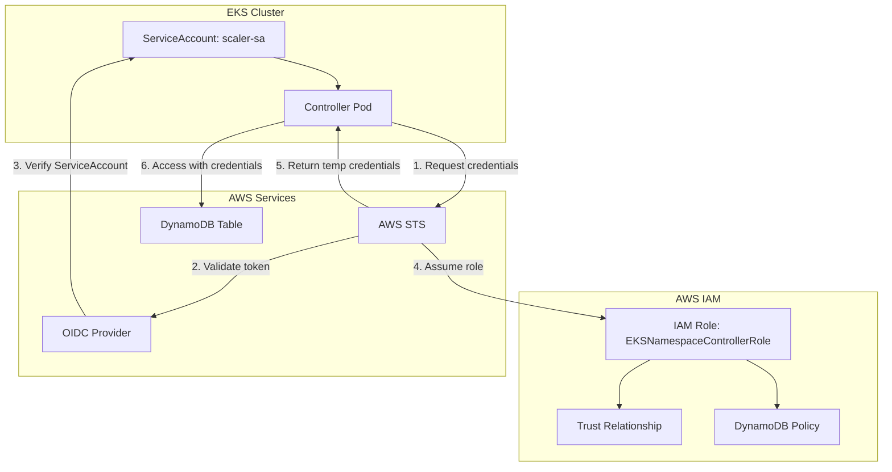

# Documento de Diseño: Configuración de Credenciales AWS para Controlador de Kubernetes

## Resumen

Este diseño implementa IAM Roles for Service Accounts (IRSA) para resolver el problema de credenciales de AWS en el controlador de namespaces de Kubernetes. La solución permite que el pod del controlador acceda de forma segura a DynamoDB sin almacenar credenciales de larga duración.

## Arquitectura

### Componentes Principales



### Flujo de Autenticación IRSA

1. **Inicio del Pod**: El pod del controlador inicia con el ServiceAccount `scaler-sa`
2. **Descubrimiento de Rol**: El AWS SDK lee la anotación `eks.amazonaws.com/role-arn` del ServiceAccount
3. **Token de ServiceAccount**: Kubernetes monta automáticamente el token JWT del ServiceAccount
4. **Solicitud de Credenciales**: El SDK llama a `sts:AssumeRoleWithWebIdentity` con el token
5. **Validación OIDC**: AWS STS valida el token contra el proveedor OIDC del cluster
6. **Asunción de Rol**: Si la validación es exitosa, STS devuelve credenciales temporales
7. **Acceso a DynamoDB**: El controlador usa las credenciales temporales para acceder a DynamoDB

## Componentes e Interfaces

### 1. IAM Role (EKSNamespaceControllerRole)

**Propósito**: Rol de IAM que define los permisos necesarios para el controlador

**Configuración**:
```json
{
  "RoleName": "EKSNamespaceControllerRole",
  "AssumeRolePolicyDocument": {
    "Version": "2012-10-17",
    "Statement": [
      {
        "Effect": "Allow",
        "Principal": {
          "Federated": "arn:aws:iam::{ACCOUNT_ID}:oidc-provider/{OIDC_PROVIDER_URL}"
        },
        "Action": "sts:AssumeRoleWithWebIdentity",
        "Condition": {
          "StringEquals": {
            "{OIDC_PROVIDER_URL}:sub": "system:serviceaccount:encendido-eks:scaler-sa",
            "{OIDC_PROVIDER_URL}:aud": "sts.amazonaws.com"
          }
        }
      }
    ]
  }
}
```

**Permisos DynamoDB**:
```json
{
  "Version": "2012-10-17",
  "Statement": [
    {
      "Effect": "Allow",
      "Action": [
        "dynamodb:GetItem",
        "dynamodb:PutItem",
        "dynamodb:UpdateItem",
        "dynamodb:DeleteItem",
        "dynamodb:Scan",
        "dynamodb:Query",
        "dynamodb:DescribeTable"
      ],
      "Resource": "arn:aws:dynamodb:us-east-1:{ACCOUNT_ID}:table/NamespaceSchedules"
    }
  ]
}
```

### 2. ServiceAccount Annotation

**Propósito**: Conectar el ServiceAccount de Kubernetes con el IAM Role

**Configuración**:
```yaml
apiVersion: v1
kind: ServiceAccount
metadata:
  name: scaler-sa
  namespace: encendido-eks
  annotations:
    eks.amazonaws.com/role-arn: arn:aws:iam::{ACCOUNT_ID}:role/EKSNamespaceControllerRole
```

### 3. OIDC Provider Configuration

**Propósito**: Permitir que AWS confíe en los tokens de ServiceAccount del cluster EKS

**Configuración**: El proveedor OIDC debe estar configurado en el cluster EKS con:
- URL del proveedor OIDC del cluster
- Thumbprint del certificado
- Audiencia: `sts.amazonaws.com`

### 4. Modificaciones al Controlador

**Propósito**: Asegurar que el controlador use correctamente las credenciales IRSA

**Cambios Necesarios**:
- El código actual ya usa `boto3.resource('dynamodb', region_name=aws_region)` que automáticamente detectará las credenciales IRSA
- Agregar logging mejorado para troubleshooting de credenciales
- Implementar retry logic específico para errores de credenciales

## Modelos de Datos

### 1. Configuración de Terraform

```hcl
# Variables
variable "cluster_name" {
  description = "Nombre del cluster EKS"
  type        = string
  default     = "your-cluster-name"
}

variable "namespace" {
  description = "Namespace donde se ejecuta el controlador"
  type        = string
  default     = "encendido-eks"
}

variable "service_account_name" {
  description = "Nombre del ServiceAccount"
  type        = string
  default     = "scaler-sa"
}

variable "dynamodb_table_name" {
  description = "Nombre de la tabla DynamoDB"
  type        = string
  default     = "NamespaceSchedules"
}

# Data sources
data "aws_caller_identity" "current" {}
data "aws_region" "current" {}
data "aws_eks_cluster" "cluster" {
  name = var.cluster_name
}

# IAM Role
resource "aws_iam_role" "controller_role" {
  name = "EKSNamespaceControllerRole"
  
  assume_role_policy = jsonencode({
    Version = "2012-10-17"
    Statement = [
      {
        Effect = "Allow"
        Principal = {
          Federated = "arn:aws:iam::${data.aws_caller_identity.current.account_id}:oidc-provider/${replace(data.aws_eks_cluster.cluster.identity[0].oidc[0].issuer, "https://", "")}"
        }
        Action = "sts:AssumeRoleWithWebIdentity"
        Condition = {
          StringEquals = {
            "${replace(data.aws_eks_cluster.cluster.identity[0].oidc[0].issuer, "https://", "")}:sub" = "system:serviceaccount:${var.namespace}:${var.service_account_name}"
            "${replace(data.aws_eks_cluster.cluster.identity[0].oidc[0].issuer, "https://", "")}:aud" = "sts.amazonaws.com"
          }
        }
      }
    ]
  })

  tags = {
    Name        = "EKSNamespaceControllerRole"
    Purpose     = "IRSA for namespace controller"
    Environment = "production"
  }
}

# IAM Policy
resource "aws_iam_policy" "controller_policy" {
  name        = "EKSNamespaceControllerPolicy"
  description = "Policy for namespace controller to access DynamoDB"

  policy = jsonencode({
    Version = "2012-10-17"
    Statement = [
      {
        Effect = "Allow"
        Action = [
          "dynamodb:GetItem",
          "dynamodb:PutItem",
          "dynamodb:UpdateItem",
          "dynamodb:DeleteItem",
          "dynamodb:Scan",
          "dynamodb:Query",
          "dynamodb:DescribeTable"
        ]
        Resource = "arn:aws:dynamodb:${data.aws_region.current.name}:${data.aws_caller_identity.current.account_id}:table/${var.dynamodb_table_name}"
      }
    ]
  })
}

# Attach policy to role
resource "aws_iam_role_policy_attachment" "controller_policy_attachment" {
  role       = aws_iam_role.controller_role.name
  policy_arn = aws_iam_policy.controller_policy.arn
}
```

### 2. Manifiestos de Kubernetes

```yaml
# ServiceAccount con anotación IRSA
apiVersion: v1
kind: ServiceAccount
metadata:
  name: scaler-sa
  namespace: encendido-eks
  annotations:
    eks.amazonaws.com/role-arn: arn:aws:iam::${ACCOUNT_ID}:role/EKSNamespaceControllerRole
---
# Deployment del controlador (actualizado)
apiVersion: apps/v1
kind: Deployment
metadata:
  name: namespace-controller
  namespace: encendido-eks
spec:
  replicas: 1
  selector:
    matchLabels:
      app: namespace-controller
  template:
    metadata:
      labels:
        app: namespace-controller
    spec:
      serviceAccountName: scaler-sa
      containers:
      - name: controller
        image: your-registry/namespace-controller:latest
        env:
        - name: AWS_REGION
          value: "us-east-1"
        - name: DYNAMODB_TABLE
          value: "NamespaceSchedules"
        - name: AWS_ROLE_SESSION_NAME
          value: "namespace-controller-session"
        ports:
        - containerPort: 8080
          name: metrics
        - containerPort: 8081
          name: health
        livenessProbe:
          httpGet:
            path: /health
            port: 8081
          initialDelaySeconds: 30
          periodSeconds: 10
        readinessProbe:
          httpGet:
            path: /health
            port: 8081
          initialDelaySeconds: 5
          periodSeconds: 5
```

## Propiedades de Corrección

*Una propiedad es una característica o comportamiento que debe mantenerse verdadero en todas las ejecuciones válidas de un sistema - esencialmente, una declaración formal sobre lo que el sistema debe hacer. Las propiedades sirven como puente entre las especificaciones legibles por humanos y las garantías de corrección verificables por máquinas.*

Ahora procederé a analizar los criterios de aceptación para determinar cuáles son testables como propiedades.

### Propiedades de Corrección

Basándome en el análisis de prework de los criterios de aceptación, las siguientes propiedades universales deben mantenerse:

**Property 1: Permisos DynamoDB completos**
*Para cualquier* operación DynamoDB válida (read, write, update, delete), el IAM Role debe tener los permisos necesarios para ejecutarla sin errores de autenticación
**Validates: Requirements 1.2, 5.1, 5.2, 5.3, 5.4**

**Property 2: Validación automática de tokens OIDC**
*Para cualquier* token válido del ServiceAccount, el proveedor OIDC debe poder validarlo y permitir la asunción del rol IAM
**Validates: Requirements 2.4**

**Property 3: Descubrimiento automático de credenciales**
*Para cualquier* pod que use el ServiceAccount anotado, debe poder descubrir automáticamente el ARN del rol y obtener credenciales temporales
**Validates: Requirements 3.3, 4.1, 4.2**

**Property 4: Preservación de metadatos existentes**
*Para cualquier* anotación o etiqueta existente en el ServiceAccount, debe mantenerse después de agregar la configuración IRSA
**Validates: Requirements 3.5**

**Property 5: Renovación automática de credenciales**
*Para cualquier* conjunto de credenciales temporales obtenidas, deben renovarse automáticamente antes de su expiración
**Validates: Requirements 4.3**

**Property 6: Uso exclusivo de credenciales IRSA**
*Para cualquier* operación AWS realizada por el controlador, debe usar únicamente las credenciales del rol asumido, nunca credenciales hardcodeadas
**Validates: Requirements 4.4**

**Property 7: Logging comprehensivo de errores**
*Para cualquier* error relacionado con credenciales (asunción fallida, permisos denegados, anotaciones faltantes), el sistema debe generar logs descriptivos y específicos
**Validates: Requirements 6.1, 6.2, 6.3**

**Property 8: Logging de éxito para debugging**
*Para cualquier* asunción exitosa de credenciales, el sistema debe generar logs de debug apropiados
**Validates: Requirements 6.4**

**Property 9: Protección de información sensible**
*Para cualquier* log generado por el sistema, no debe contener información sensible de credenciales en texto plano
**Validates: Requirements 6.5**

**Property 10: Configuración completa mediante infraestructura como código**
*Para cualquier* aplicación del código de infraestructura, todos los componentes IRSA (rol IAM, trust relationship, ServiceAccount) deben quedar configurados correctamente
**Validates: Requirements 7.4**

## Manejo de Errores

### Estrategias de Recuperación

1. **Errores de Credenciales**:
   - Retry automático con backoff exponencial
   - Logging detallado del tipo de error
   - Circuit breaker para evitar llamadas repetidas fallidas
   - Alertas automáticas para errores persistentes

2. **Errores de Configuración**:
   - Validación al inicio del pod
   - Health check que incluye verificación de credenciales
   - Documentación clara de troubleshooting
   - Scripts de diagnóstico automatizados

3. **Errores de Red/AWS**:
   - Retry con jitter para evitar thundering herd
   - Fallback a modo degradado si es posible
   - Métricas detalladas de errores por tipo
   - Timeout configurables

### Códigos de Error Específicos

```python
class IRSAError(Exception):
    """Errores relacionados con IRSA"""
    pass

class CredentialAssumptionError(IRSAError):
    """Error al asumir el rol IAM"""
    pass

class ServiceAccountConfigError(IRSAError):
    """Error en la configuración del ServiceAccount"""
    pass

class DynamoDBPermissionError(IRSAError):
    """Error de permisos en DynamoDB"""
    pass
```

### Logging Mejorado

```python
# Ejemplo de logging mejorado para credenciales
def enhanced_credential_logging():
    try:
        # Verificar anotación del ServiceAccount
        if not os.path.exists('/var/run/secrets/eks.amazonaws.com/serviceaccount/'):
            logger.error("IRSA token path not found", 
                        path="/var/run/secrets/eks.amazonaws.com/serviceaccount/",
                        troubleshooting="Verify ServiceAccount annotation and IRSA configuration")
            
        # Intentar asumir rol
        sts_client = boto3.client('sts')
        response = sts_client.get_caller_identity()
        logger.info("Successfully assumed IAM role", 
                   assumed_role_arn=response.get('Arn'),
                   account_id=response.get('Account'))
                   
    except ClientError as e:
        error_code = e.response['Error']['Code']
        if error_code == 'AccessDenied':
            logger.error("IRSA role assumption failed", 
                        error_code=error_code,
                        error_message=e.response['Error']['Message'],
                        troubleshooting="Check IAM role trust relationship and ServiceAccount annotation")
        elif error_code == 'InvalidIdentityToken':
            logger.error("Invalid ServiceAccount token", 
                        error_code=error_code,
                        troubleshooting="Check OIDC provider configuration and ServiceAccount")
```

## Estrategia de Testing

### Enfoque Dual de Testing

La estrategia de testing combina **unit tests** y **property-based tests** para cobertura comprehensiva:

- **Unit tests**: Verifican ejemplos específicos, casos edge y condiciones de error
- **Property tests**: Verifican propiedades universales a través de todos los inputs
- Ambos son complementarios y necesarios para cobertura completa

### Configuración de Property-Based Testing

**Librería**: `hypothesis` para Python
**Configuración mínima**: 100 iteraciones por test de propiedad
**Formato de etiquetas**: `# Feature: aws-credentials-fix, Property {number}: {property_text}`

### Tests de Unidad

Los unit tests se enfocan en:
- Ejemplos específicos de configuración correcta
- Casos edge como anotaciones faltantes o inválidas
- Condiciones de error específicas
- Puntos de integración entre componentes

### Tests de Propiedades

Los property tests se enfocan en:
- Propiedades universales que se mantienen para todos los inputs
- Cobertura comprehensiva de inputs a través de randomización
- Validación de invariantes del sistema
- Comportamiento correcto bajo condiciones variadas

### Herramientas de Testing

1. **AWS LocalStack**: Para simular servicios AWS en testing
2. **Kind/Minikube**: Para testing de Kubernetes local
3. **Terraform Test**: Para validar infraestructura como código
4. **Pytest**: Framework de testing principal
5. **Hypothesis**: Property-based testing
6. **Moto**: Mocking de servicios AWS

### Métricas de Testing

- Cobertura de código: mínimo 90%
- Cobertura de propiedades: todas las propiedades implementadas
- Tests de integración: end-to-end con servicios reales
- Tests de performance: bajo diferentes cargas
- Tests de seguridad: validación de permisos y accesos

## Consideraciones de Seguridad

### Principio de Menor Privilegio

- El rol IAM solo tiene permisos específicos para la tabla DynamoDB requerida
- No se otorgan permisos administrativos o de wildcard
- Restricciones específicas por namespace y ServiceAccount

### Rotación de Credenciales

- Las credenciales temporales se renuevan automáticamente
- No hay credenciales de larga duración almacenadas
- Los tokens de ServiceAccount tienen TTL limitado

### Auditoría y Monitoreo

- Todos los accesos a AWS son auditables a través de CloudTrail
- Métricas de Prometheus para monitoreo de operaciones
- Alertas automáticas para fallos de autenticación
- Logs estructurados para análisis de seguridad

### Validación de Configuración

- Verificación automática de trust relationships
- Validación de permisos mínimos requeridos
- Checks de configuración en CI/CD pipeline
- Scanning de seguridad de imágenes de contenedor