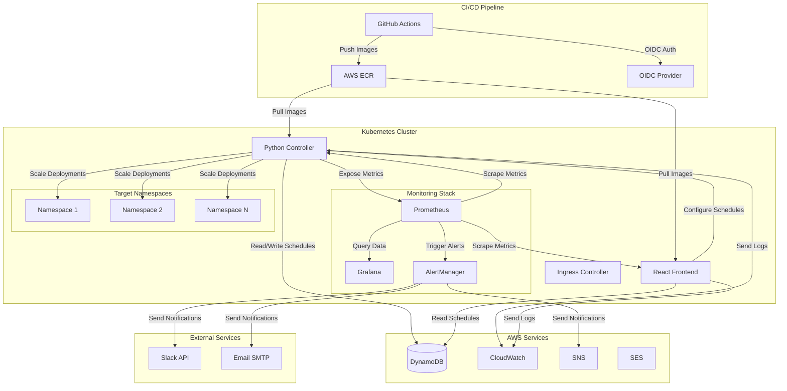

# Design Document: Namespace Auto-Shutdown System

## Overview

El sistema de apagado automático de namespaces es una solución completa para optimización de costos en Karpenter que incluye un controller Python, frontend React, pipeline CI/CD mejorado, y capacidades avanzadas de monitoreo y observabilidad. El diseño se enfoca en confiabilidad, seguridad, y operabilidad en producción.

### Key Design Principles

- **Security First**: OIDC authentication, non-root containers, vulnerability scanning
- **Observability**: Comprehensive metrics, logging, and alerting
- **Reliability**: Circuit breakers, retries, automatic rollback
- **Maintainability**: Automated testing, documentation, and clear separation of concerns

## Architecture



## Components and Interfaces

### 1. Enhanced CI/CD Pipeline

**GitHub Actions Workflow Architecture:**

```yaml
# Workflow structure with OIDC authentication
name: Build and Deploy
on:
  push:
    branches: [main, develop]
  pull_request:
    branches: [main]

permissions:
  id-token: write
  contents: read

jobs:
  security-scan:
    # Code security scanning
  
  lint-and-test:
    # YAML linting, unit tests, integration tests
  
  build-and-push:
    # Multi-stage Docker builds with OIDC auth
  
  deploy:
    # ArgoCD sync and health checks
```

**OIDC Configuration:**
- AWS IAM OIDC Provider with GitHub as trusted entity
- IAM Role with ECR permissions and trust policy
- Short-lived tokens (15 minutes) for enhanced security
- Repository-specific conditions in trust policy

### 2. Container Infrastructure

**Controller Dockerfile (Multi-stage):**

```dockerfile
# Build stage
FROM python:3.11-slim as builder
WORKDIR /app
COPY requirements.txt .
RUN pip install --user --no-cache-dir -r requirements.txt

# Production stage
FROM python:3.11-slim
RUN groupadd -r appuser && useradd -r -g appuser appuser
WORKDIR /app
COPY --from=builder /root/.local /home/appuser/.local
COPY --chown=appuser:appuser . .
USER appuser
ENV PATH=/home/appuser/.local/bin:$PATH
EXPOSE 8080
HEALTHCHECK --interval=30s --timeout=10s --start-period=5s --retries=3 \
  CMD curl -f http://localhost:8080/health || exit 1
CMD ["python", "main.py"]
```

**Frontend Dockerfile (Multi-stage):**

```dockerfile
# Build stage
FROM node:18-alpine as builder
WORKDIR /app
COPY package*.json ./
RUN npm ci --only=production
COPY . .
RUN npm run build

# Production stage
FROM nginx:alpine
RUN addgroup -g 1001 -S appuser && adduser -S appuser -G appuser
COPY --from=builder /app/dist /usr/share/nginx/html
COPY nginx.conf /etc/nginx/nginx.conf
RUN chown -R appuser:appuser /usr/share/nginx/html
USER appuser
EXPOSE 8080
HEALTHCHECK --interval=30s --timeout=10s --start-period=5s --retries=3 \
  CMD curl -f http://localhost:8080/health || exit 1
```

### 3. Python Controller Enhanced

**Core Controller Class:**

```python
class NamespaceController:
    def __init__(self):
        self.k8s_client = kubernetes.client.ApiClient()
        self.dynamodb = boto3.resource('dynamodb')
        self.metrics = PrometheusMetrics()
        self.circuit_breaker = CircuitBreaker()
        self.retry_policy = RetryPolicy()
        
    async def process_schedules(self):
        """Main processing loop with error handling and metrics"""
        
    async def scale_namespace(self, namespace: str, replicas: int):
        """Scale deployments with circuit breaker and retries"""
        
    def rollback_namespace(self, namespace: str):
        """Automatic rollback on failure"""
```

**Metrics Integration:**

```python
class PrometheusMetrics:
    def __init__(self):
        self.scaling_operations = Counter(
            'namespace_scaling_operations_total',
            'Total namespace scaling operations',
            ['namespace', 'operation', 'status']
        )
        self.scaling_duration = Histogram(
            'namespace_scaling_duration_seconds',
            'Time spent scaling namespaces',
            ['namespace', 'operation']
        )
        self.active_namespaces = Gauge(
            'namespace_active_count',
            'Number of active namespaces'
        )
```

### 4. React Frontend Enhanced

**Architecture:**
- TypeScript for type safety
- React Query for data fetching and caching
- Material-UI for consistent design
- Real-time updates via WebSocket
- Error boundaries for graceful error handling

**Key Components:**
- `ScheduleManager`: CRUD operations for namespace schedules
- `DashboardView`: Real-time system status and metrics
- `AlertsPanel`: Display active alerts and notifications
- `HealthMonitor`: System health indicators

### 5. Monitoring and Observability

**Prometheus Metrics:**

```yaml
# Controller metrics
namespace_scaling_operations_total{namespace, operation, status}
namespace_scaling_duration_seconds{namespace, operation}
namespace_active_count
controller_errors_total{error_type}
dynamodb_operations_total{operation, status}
kubernetes_api_calls_total{operation, status}

# Frontend metrics
frontend_requests_total{method, endpoint, status}
frontend_response_time_seconds{endpoint}
user_sessions_active
```

**Grafana Dashboards:**
1. **System Overview**: High-level metrics and health status
2. **Namespace Operations**: Detailed scaling operations and trends
3. **Performance Metrics**: Response times, error rates, resource usage
4. **Cost Savings**: Financial impact and optimization metrics

**Alerting Rules:**

```yaml
groups:
  - name: namespace-controller
    rules:
      - alert: ControllerDown
        expr: up{job="namespace-controller"} == 0
        for: 5m
        labels:
          severity: critical
        annotations:
          summary: "Namespace controller is down"
          
      - alert: HighErrorRate
        expr: rate(controller_errors_total[5m]) > 0.1
        for: 2m
        labels:
          severity: warning
        annotations:
          summary: "High error rate in controller"
```

## Data Models

### DynamoDB Schema

**Namespace Schedules Table:**

```json
{
  "TableName": "namespace-schedules",
  "KeySchema": [
    {"AttributeName": "namespace", "KeyType": "HASH"}
  ],
  "AttributeDefinitions": [
    {"AttributeName": "namespace", "AttributeType": "S"},
    {"AttributeName": "schedule_id", "AttributeType": "S"}
  ],
  "GlobalSecondaryIndexes": [
    {
      "IndexName": "schedule-index",
      "KeySchema": [
        {"AttributeName": "schedule_id", "KeyType": "HASH"}
      ]
    }
  ]
}
```

**Schedule Item Structure:**

```json
{
  "namespace": "production-app",
  "schedule_id": "uuid-v4",
  "enabled": true,
  "timezone": "UTC",
  "shutdown_time": "18:00",
  "startup_time": "08:00",
  "days_of_week": ["monday", "tuesday", "wednesday", "thursday", "friday"],
  "created_at": "2024-01-15T10:30:00Z",
  "updated_at": "2024-01-15T10:30:00Z",
  "created_by": "user@company.com",
  "metadata": {
    "cost_savings_target": 1000,
    "business_unit": "engineering"
  }
}
```

### Kubernetes Resources

**Controller Deployment:**

```yaml
apiVersion: apps/v1
kind: Deployment
metadata:
  name: namespace-controller
  labels:
    app: namespace-controller
spec:
  replicas: 2
  selector:
    matchLabels:
      app: namespace-controller
  template:
    metadata:
      labels:
        app: namespace-controller
      annotations:
        prometheus.io/scrape: "true"
        prometheus.io/port: "8080"
        prometheus.io/path: "/metrics"
    spec:
      serviceAccountName: namespace-controller
      securityContext:
        runAsNonRoot: true
        runAsUser: 1001
        fsGroup: 1001
      containers:
      - name: controller
        image: your-account.dkr.ecr.region.amazonaws.com/namespace-controller:latest
        ports:
        - containerPort: 8080
          name: http-metrics
        env:
        - name: DYNAMODB_TABLE
          value: "namespace-schedules"
        - name: LOG_LEVEL
          value: "INFO"
        resources:
          requests:
            memory: "128Mi"
            cpu: "100m"
          limits:
            memory: "512Mi"
            cpu: "500m"
        livenessProbe:
          httpGet:
            path: /health
            port: 8080
          initialDelaySeconds: 30
          periodSeconds: 10
        readinessProbe:
          httpGet:
            path: /ready
            port: 8080
          initialDelaySeconds: 5
          periodSeconds: 5
```

## Error Handling

### Circuit Breaker Pattern

```python
class CircuitBreaker:
    def __init__(self, failure_threshold=5, timeout=60):
        self.failure_threshold = failure_threshold
        self.timeout = timeout
        self.failure_count = 0
        self.last_failure_time = None
        self.state = "CLOSED"  # CLOSED, OPEN, HALF_OPEN
        
    async def call(self, func, *args, **kwargs):
        if self.state == "OPEN":
            if time.time() - self.last_failure_time > self.timeout:
                self.state = "HALF_OPEN"
            else:
                raise CircuitBreakerOpenError()
                
        try:
            result = await func(*args, **kwargs)
            self.on_success()
            return result
        except Exception as e:
            self.on_failure()
            raise e
```

### Retry Strategy

```python
class RetryPolicy:
    def __init__(self, max_retries=3, base_delay=1, max_delay=60):
        self.max_retries = max_retries
        self.base_delay = base_delay
        self.max_delay = max_delay
        
    async def execute(self, func, *args, **kwargs):
        for attempt in range(self.max_retries + 1):
            try:
                return await func(*args, **kwargs)
            except Exception as e:
                if attempt == self.max_retries:
                    raise e
                    
                delay = min(self.base_delay * (2 ** attempt), self.max_delay)
                await asyncio.sleep(delay)
```

### Rollback Mechanism

```python
class RollbackManager:
    def __init__(self):
        self.rollback_history = {}
        
    def save_state(self, namespace: str, deployments: List[Dict]):
        """Save current state before scaling operation"""
        self.rollback_history[namespace] = {
            'timestamp': datetime.utcnow(),
            'deployments': deployments,
            'operation_id': str(uuid.uuid4())
        }
        
    async def rollback(self, namespace: str):
        """Restore previous state"""
        if namespace not in self.rollback_history:
            raise RollbackError(f"No rollback data for namespace {namespace}")
            
        previous_state = self.rollback_history[namespace]
        for deployment in previous_state['deployments']:
            await self.k8s_client.patch_namespaced_deployment(
                name=deployment['name'],
                namespace=namespace,
                body={'spec': {'replicas': deployment['replicas']}}
            )
```

## Testing Strategy

### Dual Testing Approach

El sistema utilizará tanto unit tests como property-based tests para asegurar cobertura completa:

**Unit Tests:**
- Casos específicos y edge cases
- Integración entre componentes
- Validación de errores y condiciones límite
- Mocking de servicios externos (AWS, Kubernetes)

**Property-Based Tests:**
- Propiedades universales que deben mantenerse
- Validación con datos generados aleatoriamente
- Mínimo 100 iteraciones por test
- Cada test referencia una propiedad específica del diseño

**Testing Configuration:**
- Framework: pytest para Python, Jest para React
- Property testing: Hypothesis para Python, fast-check para JavaScript
- Coverage mínima: 80% para código crítico
- Integration tests con testcontainers para DynamoDB y Kubernetes

**Test Tagging Format:**
```python
# Feature: namespace-auto-shutdown-system, Property 1: Schedule validation consistency
def test_schedule_validation_property():
    pass
```

## Correctness Properties

*A property is a characteristic or behavior that should hold true across all valid executions of a system-essentially, a formal statement about what the system should do. Properties serve as the bridge between human-readable specifications and machine-verifiable correctness guarantees.*

### Property 1: Pipeline OIDC Authentication Consistency
*For any* GitHub Actions workflow execution, authentication to AWS ECR should succeed using OIDC tokens without requiring stored access keys, and all pipeline operations should complete successfully when authentication is valid.
**Validates: Requirements 1.1, 1.6**

### Property 2: Container Security Standards
*For any* Docker image built by the pipeline, the resulting container should run as a non-root user, have minimal attack surface, and pass security vulnerability scans before deployment.
**Validates: Requirements 2.1, 2.3, 2.4**

### Property 3: Health Check Responsiveness
*For any* deployed container with health checks configured, both liveness and readiness probes should respond successfully within the configured timeout period.
**Validates: Requirements 2.5**

### Property 4: Comprehensive Logging
*For any* controller operation (scaling, error, or status change), the monitoring system should generate a structured log entry with timestamp, operation details, and relevant metadata.
**Validates: Requirements 3.1, 3.2**

### Property 5: Metrics Collection Consistency
*For any* system component, Prometheus-compatible metrics should be exposed and updated in real-time, including scaling operations, resource utilization, and performance indicators.
**Validates: Requirements 3.3, 4.1, 4.2, 4.3, 4.4**

### Property 6: Alert Triggering and Delivery
*For any* system condition that exceeds configured thresholds, appropriate alerts should be triggered and delivered to all configured channels (Slack, email, SNS) with actionable information.
**Validates: Requirements 3.4, 7.1, 7.2, 7.3**

### Property 7: Test Coverage and Execution
*For any* code change, the test suite should execute all relevant tests (unit, integration, security, performance) and achieve minimum coverage requirements before allowing deployment.
**Validates: Requirements 5.1, 5.2, 5.3, 5.4, 5.5**

### Property 8: Documentation Generation and Accuracy
*For any* code with annotations, API documentation should be automatically generated and remain synchronized with the actual implementation, and deployment guides should provide working instructions.
**Validates: Requirements 6.1, 6.3, 6.4, 6.5**

### Property 9: Alert Suppression During Maintenance
*For any* maintenance window period, non-critical alerts should be suppressed while critical alerts continue to be delivered, and custom alert rules should be evaluated correctly against real-time metrics.
**Validates: Requirements 7.4, 7.5**

### Property 10: Automatic Rollback Behavior
*For any* scaling operation that fails repeatedly or triggers health check failures, the rollback system should restore the previous known-good state, notify the operations team, and prevent new operations during rollback.
**Validates: Requirements 8.1, 8.2, 8.3, 8.4, 8.5**

### Property 11: Security Policy Enforcement
*For any* code commit, container build, or deployment, security scanners should analyze for vulnerabilities and compliance violations, and block deployments that violate security policies while alerting the security team.
**Validates: Requirements 9.1, 9.2, 9.3, 9.4, 9.5**

### Property 12: System Resilience Under Failure
*For any* external service failure (DynamoDB, Kubernetes API, network connectivity), the system should implement appropriate fallback mechanisms (caching, queuing, retries) and maintain core functionality while recovering gracefully.
**Validates: Requirements 10.1, 10.2, 10.3, 10.4, 10.5**

### Property 13: YAML Validation Completeness
*For any* Kubernetes manifest file in the repository, the linting process should validate syntax, schema compliance, and best practices, rejecting invalid configurations before deployment.
**Validates: Requirements 1.4**

### Property 14: Pipeline Error Handling
*For any* pipeline failure, clear error messages should be provided with sufficient context for debugging, and rollback capabilities should be available to restore previous states.
**Validates: Requirements 1.7**

### Property 15: Frontend Security Headers
*For any* HTTP response from the frontend application, appropriate security headers should be included (CSP, HSTS, X-Frame-Options) to protect against common web vulnerabilities.
**Validates: Requirements 2.2**

### Property-Based Testing Configuration

**Testing Framework Selection:**
- **Python**: Hypothesis for property-based testing
- **JavaScript/TypeScript**: fast-check for property-based testing
- **Minimum iterations**: 100 per property test
- **Test tagging**: Each property test must reference its design document property

**Example Property Test Structure:**

```python
# Feature: namespace-auto-shutdown-system, Property 1: Pipeline OIDC Authentication Consistency
@given(workflow_configs())
def test_pipeline_authentication_property(workflow_config):
    # Test that OIDC authentication works for any valid workflow configuration
    result = execute_pipeline_with_oidc(workflow_config)
    assert result.authentication_successful
    assert not result.used_access_keys
    assert result.pipeline_completed_successfully
```

## Advanced Error Handling

### Distributed System Failure Patterns

**Cascade Failure Prevention:**

```python
class CascadeFailurePreventor:
    def __init__(self):
        self.component_health = {}
        self.isolation_rules = {}
        
    async def monitor_component_health(self, component: str):
        """Monitor individual component health and isolate on failure"""
        health_status = await self.check_component_health(component)
        
        if health_status.is_failing:
            await self.isolate_component(component)
            await self.notify_operations_team(component, health_status)
            
    async def isolate_component(self, component: str):
        """Isolate failing component to prevent cascade failures"""
        isolation_config = self.isolation_rules.get(component)
        if isolation_config:
            await self.apply_isolation(component, isolation_config)
```

**Graceful Degradation:**

```python
class GracefulDegradationManager:
    def __init__(self):
        self.feature_flags = {}
        self.fallback_strategies = {}
        
    async def handle_service_degradation(self, service: str, error: Exception):
        """Handle service degradation with appropriate fallback"""
        if service == "dynamodb":
            return await self.use_local_cache_fallback()
        elif service == "kubernetes_api":
            return await self.queue_operations_fallback()
        elif service == "prometheus":
            return await self.use_basic_logging_fallback()
```

### Advanced Monitoring and Alerting

**Smart Alert Correlation:**

```python
class AlertCorrelationEngine:
    def __init__(self):
        self.alert_patterns = {}
        self.correlation_rules = {}
        
    async def correlate_alerts(self, alerts: List[Alert]) -> List[CorrelatedAlert]:
        """Correlate related alerts to reduce noise"""
        correlated = []
        
        for alert in alerts:
            correlation = await self.find_correlation(alert)
            if correlation:
                correlated.append(correlation)
            else:
                correlated.append(CorrelatedAlert.from_single(alert))
                
        return correlated
```

**Predictive Alerting:**

```python
class PredictiveAlertingSystem:
    def __init__(self):
        self.ml_models = {}
        self.trend_analyzers = {}
        
    async def analyze_trends(self, metrics: List[Metric]):
        """Analyze metric trends to predict potential issues"""
        for metric in metrics:
            trend = await self.trend_analyzers[metric.type].analyze(metric)
            
            if trend.indicates_future_problem:
                await self.send_predictive_alert(metric, trend)
```

## Enhanced Testing Strategy

### Comprehensive Testing Pyramid

**Unit Tests (Base Layer):**
- **Coverage Target**: 85% for critical paths, 70% overall
- **Focus Areas**: Business logic, data validation, error handling
- **Mocking Strategy**: Mock external dependencies (AWS, Kubernetes)
- **Test Data**: Use factories and fixtures for consistent test data

**Integration Tests (Middle Layer):**
- **Scope**: Component interactions, database operations, API calls
- **Environment**: Testcontainers for DynamoDB, Kind for Kubernetes
- **Data Management**: Test data isolation and cleanup
- **Performance**: Response time and throughput validation

**Property-Based Tests (Quality Layer):**
- **Universal Properties**: System invariants and correctness properties
- **Data Generation**: Hypothesis strategies for complex data structures
- **Shrinking**: Automatic test case minimization on failure
- **Regression**: Property violations become permanent regression tests

**End-to-End Tests (Top Layer):**
- **User Journeys**: Complete workflows from UI to backend
- **Environment**: Staging environment with production-like data
- **Monitoring**: Test execution metrics and failure analysis
- **Automation**: Scheduled execution and result reporting

### Testing Infrastructure

**Test Environment Management:**

```yaml
# docker-compose.test.yml
version: '3.8'
services:
  dynamodb-local:
    image: amazon/dynamodb-local
    ports:
      - "8000:8000"
    command: ["-jar", "DynamoDBLocal.jar", "-sharedDb", "-inMemory"]
    
  kubernetes-test:
    image: kindest/node:v1.27.0
    privileged: true
    ports:
      - "6443:6443"
    
  prometheus-test:
    image: prom/prometheus:latest
    ports:
      - "9090:9090"
    volumes:
      - ./test/prometheus.yml:/etc/prometheus/prometheus.yml
```

**Continuous Testing Pipeline:**

```yaml
# .github/workflows/test.yml
name: Comprehensive Testing
on: [push, pull_request]

jobs:
  unit-tests:
    runs-on: ubuntu-latest
    steps:
      - uses: actions/checkout@v4
      - name: Run Unit Tests
        run: |
          pytest tests/unit/ --cov=src --cov-report=xml
          
  property-tests:
    runs-on: ubuntu-latest
    steps:
      - uses: actions/checkout@v4
      - name: Run Property Tests
        run: |
          pytest tests/properties/ --hypothesis-profile=ci
          
  integration-tests:
    runs-on: ubuntu-latest
    services:
      dynamodb:
        image: amazon/dynamodb-local
        ports:
          - 8000:8000
    steps:
      - uses: actions/checkout@v4
      - name: Run Integration Tests
        run: |
          pytest tests/integration/ --dynamodb-endpoint=http://localhost:8000
          
  e2e-tests:
    runs-on: ubuntu-latest
    steps:
      - uses: actions/checkout@v4
      - name: Setup Test Environment
        run: |
          kind create cluster
          kubectl apply -f k8s/test/
      - name: Run E2E Tests
        run: |
          pytest tests/e2e/ --kubernetes-config=~/.kube/config
```

### Performance and Load Testing

**Load Testing Strategy:**

```python
# tests/performance/load_test.py
import asyncio
from locust import HttpUser, task, between

class NamespaceControllerUser(HttpUser):
    wait_time = between(1, 3)
    
    @task(3)
    def get_schedules(self):
        self.client.get("/api/schedules")
        
    @task(1)
    def create_schedule(self):
        schedule_data = {
            "namespace": f"test-{random.randint(1, 1000)}",
            "shutdown_time": "18:00",
            "startup_time": "08:00"
        }
        self.client.post("/api/schedules", json=schedule_data)
        
    @task(2)
    def update_schedule(self):
        schedule_id = random.choice(self.existing_schedules)
        update_data = {"enabled": random.choice([True, False])}
        self.client.put(f"/api/schedules/{schedule_id}", json=update_data)
```

**Performance Benchmarking:**

```python
# tests/performance/benchmark_test.py
import pytest
import time
from hypothesis import given, strategies as st

class TestPerformanceBenchmarks:
    
    @pytest.mark.benchmark
    def test_schedule_processing_performance(self, benchmark):
        """Benchmark schedule processing performance"""
        result = benchmark(self.controller.process_schedules)
        assert result.execution_time < 5.0  # 5 second SLA
        
    @given(st.lists(st.text(), min_size=1, max_size=100))
    def test_scaling_operation_performance(self, namespaces):
        """Test scaling performance with varying namespace counts"""
        start_time = time.time()
        
        for namespace in namespaces:
            self.controller.scale_namespace(namespace, 0)
            
        execution_time = time.time() - start_time
        
        # Performance should scale linearly with namespace count
        assert execution_time < len(namespaces) * 0.1  # 100ms per namespace
```

### Security Testing

**Security Test Suite:**

```python
# tests/security/security_test.py
class TestSecurityValidation:
    
    def test_container_runs_as_non_root(self):
        """Verify containers run as non-root user"""
        container_info = docker.inspect_container("namespace-controller")
        assert container_info["Config"]["User"] != "root"
        assert container_info["Config"]["User"] != "0"
        
    def test_no_sensitive_data_in_logs(self):
        """Verify no sensitive data appears in logs"""
        log_entries = self.get_recent_logs()
        
        for entry in log_entries:
            assert not self.contains_sensitive_data(entry)
            
    def test_rbac_least_privilege(self):
        """Verify RBAC follows least privilege principle"""
        service_account = self.k8s_client.read_namespaced_service_account(
            name="namespace-controller",
            namespace="default"
        )
        
        permissions = self.get_effective_permissions(service_account)
        assert self.validates_least_privilege(permissions)
```

### Chaos Engineering

**Chaos Testing Framework:**

```python
# tests/chaos/chaos_test.py
import chaostoolkit
from chaostoolkit.types import Configuration, Secrets

class TestChaosEngineering:
    
    def test_dynamodb_failure_resilience(self):
        """Test system resilience when DynamoDB is unavailable"""
        # Simulate DynamoDB failure
        self.chaos_toolkit.run_experiment({
            "title": "DynamoDB Unavailable",
            "description": "Test system behavior when DynamoDB is down",
            "steady-state-hypothesis": {
                "title": "System remains operational",
                "probes": [
                    {
                        "name": "controller-health-check",
                        "type": "probe",
                        "provider": {
                            "type": "http",
                            "url": "http://controller:8080/health"
                        }
                    }
                ]
            },
            "method": [
                {
                    "name": "stop-dynamodb",
                    "type": "action",
                    "provider": {
                        "type": "process",
                        "path": "docker",
                        "arguments": ["stop", "dynamodb-local"]
                    }
                }
            ]
        })
        
    def test_kubernetes_api_failure_resilience(self):
        """Test system resilience when Kubernetes API is unavailable"""
        # Implementation for Kubernetes API failure simulation
        pass
        
    def test_network_partition_resilience(self):
        """Test system resilience during network partitions"""
        # Implementation for network partition simulation
        pass
```

This comprehensive testing strategy ensures the namespace auto-shutdown system is robust, reliable, and maintainable in production environments. The combination of unit tests, property-based tests, integration tests, performance tests, security tests, and chaos engineering provides complete coverage of system behavior under normal and exceptional conditions.