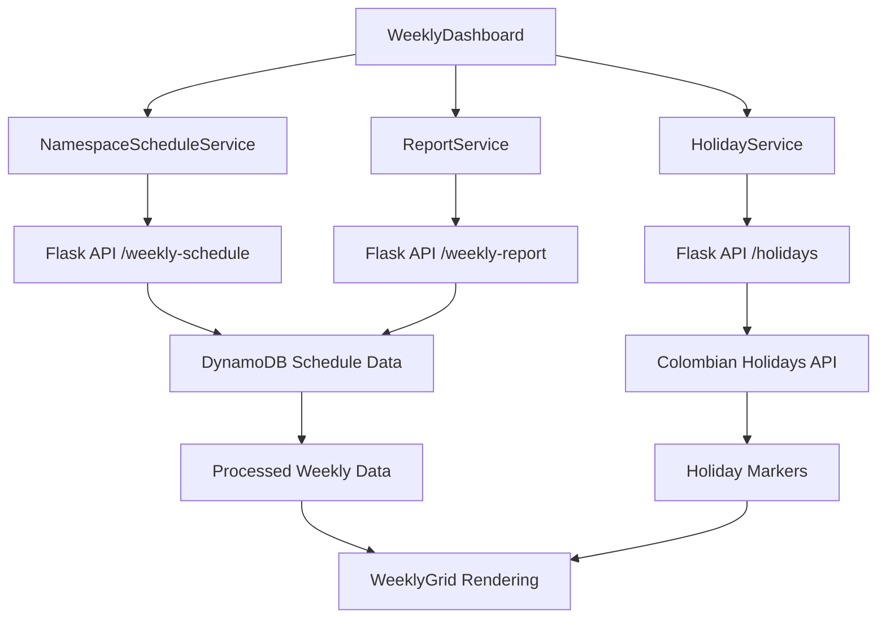

# Namespace Scheduler - Diseño Técnico

## Arquitectura del Sistema

### Componentes Principales

1. **Frontend (SPA)**
   - Tecnología: HTML5, CSS3, JavaScript vanilla, Bootstrap 5
   - Funcionalidades: Interfaz de usuario, calendario, gestión de tareas, vista semanal
   - Puerto: 80 (nginx)

2. **Backend (API REST)**
   - Tecnología: Python Flask, boto3, croniter
   - Funcionalidades: API REST, scheduler, kubectl wrapper
   - Puerto: 8080

3. **Base de Datos**
   - DynamoDB: Logs de actividades y permisos de centros de costo
   - Almacenamiento local: Configuración de tareas (JSON)

4. **Infraestructura**
   - Kubernetes: EKS cluster
   - ArgoCD: Despliegue continuo
   - ECR: Registro de imágenes
   - GitHub Actions: CI/CD

## Diseño de la API

### Endpoints Principales

```
GET /health - Health check
GET /api/namespaces - Listar namespaces
GET /api/namespaces/status - Estado de namespaces
POST /api/namespaces/{namespace}/activate - Activar namespace
POST /api/namespaces/{namespace}/deactivate - Desactivar namespace

GET /api/tasks - Listar tareas
POST /api/tasks - Crear tarea
GET /api/tasks/{id} - Obtener tarea
DELETE /api/tasks/{id} - Eliminar tarea
POST /api/tasks/{id}/run - Ejecutar tarea

GET /api/logs - Obtener logs
GET /api/activities - Obtener actividades por centro de costo

GET /api/cost-centers - Listar centros de costo
GET /api/cost-centers/{cost_center}/validate - Validar permisos de centro de costo
POST /api/cost-centers/{cost_center}/permissions - Configurar permisos de centro de costo

# Nuevos endpoints para vista semanal
GET /api/weekly-schedule/{week_start_date} - Obtener programación semanal
GET /api/holidays/{year} - Obtener festivos colombianos
GET /api/weekly-report/{week_start_date} - Generar reporte semanal
GET /api/namespace-usage/{namespace_id} - Obtener uso de namespace
```

### Modelo de Datos

#### Tarea (Task)
```json
{
  "id": "string",
  "title": "string",
  "operation_type": "activate|deactivate|command",
  "command": "string",
  "schedule": "string (cron)",
  "namespace": "string",
  "cost_center": "string",
  "status": "pending|running|completed|failed",
  "created_at": "datetime",
  "next_run": "datetime",
  "run_count": "number",
  "success_count": "number",
  "error_count": "number"
}
```

#### Actividad DynamoDB
```json
{
  "namespace_name": "string (hash key)",
  "timestamp_start": "number (range key)",
  "operation_type": "string",
  "cost_center": "string",
  "cluster_name": "string",
  "requested_by": "string",
  "approved_by": "string",
  "user_id": "string",
  "status": "active|completed",
  "timestamp_end": "number",
  "duration_minutes": "number"
}
```

**Índices Secundarios Globales:**
- `cost-center-timestamp-index`: Para consultas por centro de costo
- `operation-type-timestamp-index`: Para consultas por tipo de operación
- `cluster-timestamp-index`: Para consultas por cluster específico
- `requested-by-timestamp-index`: Para auditoría por usuario solicitante

## Lógica de Negocio

### Validación de Horarios
- **Horario laboral**: Lunes a Viernes, 7:00 AM - 8:00 PM
- **Horario no laboral**: Resto del tiempo
- **Límite**: Máximo 5 namespaces activos en horario no laboral

### Gestión de Namespaces
1. **Activación**: Escalar recursos a réplicas originales (default: 1)
2. **Desactivación**: Escalar todos los recursos a 0 réplicas
3. **Validación**: Verificar permisos de centro de costo
4. **Logging**: Registrar todas las operaciones en DynamoDB

### Scheduler de Tareas
- Verificación cada minuto de tareas pendientes
- Ejecución en threads separados
- Cálculo automático de próxima ejecución
- Manejo de errores y reintentos

## Vista Semanal del Dashboard - Extensión de Diseño

### Overview

Esta extensión agrega una vista semanal mejorada para el dashboard del Namespace Scheduler. La nueva vista complementa el dashboard básico actual con una interfaz de grilla de 7 días x 24 horas que muestra claramente qué namespaces están programados para estar activos en cada momento de la semana.

El diseño se integra completamente con la arquitectura existente (Frontend JavaScript vanilla, Backend Flask, DynamoDB) y agrega funcionalidades avanzadas como marcado de festivos colombianos y reportes semanales de uso por centro de costo.

## Architecture

### Frontend Architecture - Extensión para Vista Semanal

La nueva vista semanal se implementará como un componente adicional del frontend existente, manteniendo la arquitectura de JavaScript vanilla con Bootstrap 5.

```
Frontend Components (Existentes + Nuevos):
├── TaskScheduler (Existing Main Class)
├── WeeklyDashboard (New Component)
│   ├── WeeklyGrid (7x24 grid display)
│   ├── NavigationControls (week navigation)
│   ├── HolidayMarker (Colombian holidays)
│   └── WeeklyReport (usage report)
├── NamespaceScheduleService (New - data fetching)
├── HolidayService (New - Colombian holidays API)
└── ReportService (New - usage calculations)
```

### Backend Architecture - Extensión para Vista Semanal

El backend Flask se extenderá con nuevos endpoints para soportar la vista semanal:

```
Backend Extensions:
├── /api/weekly-schedule/<week_start_date>
├── /api/holidays/<year>
├── /api/weekly-report/<week_start_date>
└── /api/namespace-usage/<namespace>/<date_range>
```

### Data Flow



## Configuración de Despliegue

### Estructura de Manifiestos
```
manifests/
├── base/
│   ├── namespace.yaml
│   ├── kubectl-runner-rbac.yaml
│   ├── task-scheduler-deployment.yaml
│   ├── task-scheduler-service.yaml
│   └── kustomization.yaml
└── overlays/
    └── production/
        ├── ingress.yaml
        ├── task-scheduler-patch.yaml
        ├── backstage-patch.yaml
        └── kustomization.yaml
```

### RBAC Requerido
```yaml
apiVersion: rbac.authorization.k8s.io/v1
kind: ClusterRole
metadata:
  name: kubectl-runner
rules:
- apiGroups: [""]
  resources: ["namespaces", "pods"]
  verbs: ["get", "list", "watch"]
- apiGroups: ["apps"]
  resources: ["deployments", "statefulsets", "daemonsets"]
  verbs: ["get", "list", "patch", "update"]
- apiGroups: ["apps"]
  resources: ["deployments/scale", "statefulsets/scale"]
  verbs: ["get", "patch", "update"]
```

### Variables de Entorno
```yaml
env:
- name: EKS_CLUSTER_NAME
  value: "production-cluster"
- name: AWS_REGION
  value: "us-east-1"
- name: DYNAMODB_TABLE_NAME
  value: "task-scheduler-logs-production"
- name: PERMISSIONS_TABLE_NAME
  value: "cost-center-permissions-production"
```

## Pipeline de CI/CD

### GitHub Actions Workflow
```yaml
name: Build and Deploy
on:
  push:
    branches: [main]
jobs:
  build-frontend:
    - Build frontend image
    - Push to ECR
  build-backend:
    - Build backend image
    - Push to ECR
  update-manifests:
    - Update image tags in manifests
    - Commit changes
```

### ArgoCD Application
```yaml
apiVersion: argoproj.io/v1alpha1
kind: Application
metadata:
  name: namespace-scheduler
spec:
  source:
    repoURL: https://github.com/user/namespace-scheduler
    path: manifests/overlays/production
    targetRevision: main
  destination:
    server: https://kubernetes.default.svc
    namespace: task-scheduler
  syncPolicy:
    automated:
      prune: true
      selfHeal: true
```

## Seguridad

### Autenticación y Autorización
- Service Account con RBAC limitado
- Validación de centros de costo
- Logs de auditoría en DynamoDB

### Configuración de Red
- Ingress con TLS
- Network policies para limitar tráfico
- Service mesh (opcional)

## Monitoreo

### Métricas
- Número de namespaces activos
- Tareas ejecutadas/fallidas
- Tiempo de respuesta de API
- Uso de recursos

### Logs
- Logs estructurados en JSON
- Rotación automática
- Integración con CloudWatch (opcional)

### Health Checks
- Endpoint `/health` para readiness/liveness
- Verificación de conectividad a DynamoDB
- Verificación de acceso a cluster

## Propiedades de Correctitud

### 1. Límite de Namespaces en Horario No Laboral
**Propiedad**: Durante horarios no laborales, nunca debe haber más de 5 namespaces activos simultáneamente.

**Validación**: Para cualquier timestamp en horario no laboral, contar namespaces activos ≤ 5

### 2. Validación de Centros de Costo
**Propiedad**: Toda operación debe estar asociada a un centro de costo válido y autorizado.

**Validación**: Para toda operación, existe un centro de costo con `is_authorized = true`

### 3. Consistencia de Estados
**Propiedad**: El estado reportado de un namespace debe coincidir con su estado real en Kubernetes.

**Validación**: Para todo namespace, `reported_status == kubectl_status`

### 4. Programación de Tareas
**Propiedad**: Las tareas programadas deben ejecutarse dentro de una ventana de tiempo aceptable.

**Validación**: Para toda tarea programada, `|execution_time - scheduled_time| ≤ 2 minutos`

### 5. Logging de Actividades
**Propiedad**: Toda operación de activación/desactivación debe generar un log en DynamoDB.

**Validación**: Para toda operación, existe un registro correspondiente en DynamoDB

### 6. Vista Semanal - Consistencia de Datos
**Propiedad**: Los datos mostrados en la vista semanal deben coincidir con los datos reales de programación.

**Validación**: Para toda programación mostrada en la vista semanal, existe una tarea correspondiente en la base de datos

### 7. Festivos Colombianos - Identificación Correcta
**Propiedad**: Todos los días festivos oficiales de Colombia deben ser identificados correctamente.

**Validación**: Para todo día festivo oficial, el sistema debe marcarlo como festivo en la vista semanal

### 8. Reportes Semanales - Cálculo Preciso
**Propiedad**: Las horas calculadas en los reportes semanales deben coincidir con las horas reales de uso.

**Validación**: Para todo reporte semanal, `horas_calculadas == horas_reales_de_uso`

## Framework de Testing

- **Unit Tests**: pytest para lógica de negocio
- **Integration Tests**: Pruebas de API con cluster de prueba
- **Property-Based Tests**: Hypothesis para validar propiedades de correctitud
- **E2E Tests**: Selenium para interfaz web
- **Vista Semanal Tests**: Pruebas específicas para componentes de vista semanal

## Consideraciones de Performance

- **Caching**: Cache de lista de namespaces (TTL: 30s)
- **Rate Limiting**: Límite de operaciones por minuto
- **Async Operations**: Operaciones de kubectl en background
- **Connection Pooling**: Pool de conexiones a DynamoDB
- **Vista Semanal Caching**: Cache de datos semanales para navegación rápida
- **Lazy Loading**: Carga diferida de datos de semanas no actuales

## Plan de Rollback

1. **Rollback de ArgoCD**: Revertir a versión anterior
2. **Rollback de Imágenes**: Usar tags anteriores
3. **Rollback de Base de Datos**: Backup/restore de DynamoDB
4. **Rollback Manual**: Procedimientos de emergencia
5. **Vista Semanal Rollback**: Desactivar vista semanal y volver al dashboard original

## Extensiones de Vista Semanal - Componentes Detallados

### WeeklyDashboard Component

**Responsabilidades:**
- Coordinar la renderización de la grilla semanal
- Manejar navegación entre semanas
- Integrar marcadores de festivos
- Mostrar reportes de uso

**Interface:**
```javascript
class WeeklyDashboard {
    constructor(containerId, apiClient)
    
    // Core methods
    render()
    loadWeekData(weekStartDate)
    navigateToWeek(direction) // 'prev' | 'next' | 'current'
    
    // Event handlers
    onTimeSlotClick(day, hour, namespaces)
    onWeekChange(weekStartDate)
    
    // Data management
    refreshData()
    cacheWeekData(weekStartDate, data)
}
```

### WeeklyGrid Component

**Responsabilidades:**
- Renderizar la grilla de 7 días x 24 horas
- Mostrar namespaces programados en cada slot
- Aplicar estilos visuales diferenciados
- Manejar interacciones de usuario

**Interface:**
```javascript
class WeeklyGrid {
    constructor(containerElement)
    
    // Rendering methods
    renderGrid(weekData, holidays)
    renderTimeSlot(day, hour, namespaces, isHoliday)
    renderNamespaceTag(namespace, costCenter, isActive)
    
    // Visual methods
    applyHolidayStyles(dayElement)
    highlightContinuousSchedule(namespace, timeSlots)
    showTooltip(element, details)
    
    // Interaction methods
    bindTimeSlotEvents()
    handleTimeSlotHover(event)
    handleTimeSlotClick(event)
}
```

### NamespaceScheduleService

**Responsabilidades:**
- Obtener datos de programación desde la API
- Procesar y formatear datos para la vista semanal
- Manejar caché de datos
- Gestionar estados de carga y errores

**Interface:**
```javascript
class NamespaceScheduleService {
    constructor(apiClient)
    
    // Data fetching
    async getWeeklySchedule(weekStartDate)
    async getNamespaceDetails(namespaceId)
    
    // Data processing
    processScheduleData(rawData)
    groupByTimeSlots(scheduleData)
    
    // Caching
    cacheWeekData(weekStartDate, data)
    getCachedWeekData(weekStartDate)
    clearCache()
}
```

### HolidayService

**Responsabilidades:**
- Obtener festivos colombianos
- Identificar si una fecha es festivo
- Proporcionar información de festivos para tooltips

**Interface:**
```javascript
class HolidayService {
    constructor()
    
    // Holiday data
    async getColombianHolidays(year)
    isHoliday(date)
    getHolidayInfo(date)
    
    // Caching
    cacheHolidays(year, holidays)
    getCachedHolidays(year)
}
```

### ReportService

**Responsabilidades:**
- Calcular horas de uso por namespace
- Generar reportes semanales por centro de costo
- Exportar reportes en diferentes formatos

**Interface:**
```javascript
class ReportService {
    constructor(apiClient)
    
    // Report generation
    async generateWeeklyReport(weekStartDate)
    calculateNamespaceHours(namespace, scheduleData)
    groupByCostCenter(usageData)
    
    // Export functionality
    exportToCSV(reportData)
    exportToExcel(reportData)
    
    // Display
    renderReportTable(reportData)
}
```

## Data Models

### WeeklyScheduleData

```javascript
{
    weekStartDate: "2024-01-15", // ISO date string
    weekEndDate: "2024-01-21",
    timeSlots: {
        "monday": {
            "00": [
                {
                    namespaceId: "prod-api",
                    namespaceName: "Production API",
                    costCenter: "CC-001",
                    isActive: true,
                    scheduleType: "cron", // 'cron' | 'manual'
                    duration: 60 // minutes
                }
            ],
            "01": [...],
            // ... 24 hours
        },
        // ... 7 days
    },
    holidays: [
        {
            date: "2024-01-15",
            name: "Día de Martin Luther King Jr.",
            isNational: true
        }
    ]
}
```

### NamespaceUsageReport

```javascript
{
    weekStartDate: "2024-01-15",
    weekEndDate: "2024-01-21",
    totalHours: 1680, // Total possible hours (7 days * 24 hours * 10 namespaces)
    usedHours: 420,   // Actually used hours
    costCenters: [
        {
            costCenterId: "CC-001",
            costCenterName: "Development Team",
            totalHours: 168,
            namespaces: [
                {
                    namespaceId: "dev-api",
                    namespaceName: "Development API",
                    scheduledHours: 120,
                    actualHours: 118,
                    efficiency: 98.3 // percentage
                }
            ]
        }
    ]
}
```

### HolidayData

```javascript
{
    year: 2024,
    holidays: [
        {
            date: "2024-01-01",
            name: "Año Nuevo",
            type: "national",
            isFixed: true
        },
        {
            date: "2024-03-25",
            name: "Día de San José",
            type: "national",
            isFixed: false // Moved to Monday
        }
    ]
}
```

## API Endpoints

### GET /api/weekly-schedule/{week_start_date}

**Descripción:** Obtiene la programación de namespaces para una semana específica

**Parámetros:**
- `week_start_date`: Fecha de inicio de semana en formato ISO (YYYY-MM-DD)

**Respuesta:**
```json
{
    "success": true,
    "data": {
        "weekStartDate": "2024-01-15",
        "weekEndDate": "2024-01-21",
        "timeSlots": { /* WeeklyScheduleData structure */ }
    }
}
```

### GET /api/holidays/{year}

**Descripción:** Obtiene los festivos colombianos para un año específico

**Parámetros:**
- `year`: Año en formato YYYY

**Respuesta:**
```json
{
    "success": true,
    "data": {
        "year": 2024,
        "holidays": [ /* HolidayData structure */ ]
    }
}
```

### GET /api/weekly-report/{week_start_date}

**Descripción:** Genera reporte de uso semanal por namespace y centro de costo

**Parámetros:**
- `week_start_date`: Fecha de inicio de semana en formato ISO
- `format`: (opcional) 'json' | 'csv' | 'excel'

**Respuesta:**
```json
{
    "success": true,
    "data": { /* NamespaceUsageReport structure */ }
}
```

### GET /api/namespace-usage/{namespace_id}

**Descripción:** Obtiene detalles de uso para un namespace específico

**Parámetros:**
- `namespace_id`: ID del namespace
- `start_date`: Fecha de inicio del rango
- `end_date`: Fecha de fin del rango

**Respuesta:**
```json
{
    "success": true,
    "data": {
        "namespaceId": "prod-api",
        "usage": [
            {
                "date": "2024-01-15",
                "scheduledHours": 24,
                "actualHours": 23.5,
                "costCenter": "CC-001"
            }
        ]
    }
}
```