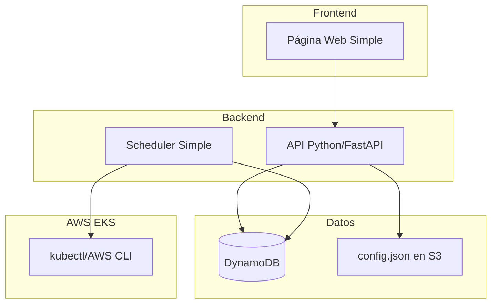

# Documento de Diseño: Sistema MVP de Auto-Encendido de Namespaces

## Visión General

Sistema web simple para programar encendido y apagado automático de namespaces en EKS (AWS). Arquitectura básica: frontend web + API Python + scheduler + DynamoDB.

## Arquitectura

### Componentes Principales



## Componentes e Interfaces

### 1. Frontend Web Simple

**Tecnología**: HTML + CSS + JavaScript básico

**Páginas**:
- Lista de programaciones
- Formulario nueva programación

**Formulario**:
```javascript
{
  namespace: "string",
  fecha: "YYYY-MM-DD",
  hora_encendido: "HH:MM",
  hora_apagado: "HH:MM", 
  usuario: "string",
  proyecto: "string",
  centro_costo: "string"
}
```

### 2. API Python

**Tecnología**: FastAPI + boto3 (AWS SDK) + DynamoDB

**Endpoints básicos**:
```
GET    /programaciones     # Listar
POST   /programaciones     # Crear
DELETE /programaciones/:id # Eliminar
GET    /namespaces         # Listar namespaces de EKS
GET    /centros-costo/:ns  # Centros de costo válidos (desde S3)
```

**Modelo básico**:
```python
import boto3
from pydantic import BaseModel

class Programacion(BaseModel):
    id: str
    namespace: str
    fecha_encendido: datetime
    fecha_apagado: datetime
    usuario: str
    proyecto: str
    centro_costo: str
    estado: str  # 'pendiente', 'encendido', 'completada'

# Cliente DynamoDB
dynamodb = boto3.resource('dynamodb', region_name='us-east-1')
table = dynamodb.Table('programaciones-namespaces')
```

### 3. Scheduler Simple

**Funcionalidad**:
- Ejecuta cada minuto (Lambda o ECS Task)
- Verifica programaciones pendientes en DynamoDB
- Ejecuta comandos AWS CLI/kubectl para escalar EKS

### 4. Validador de Centros de Costo

**Archivo config.json en S3**:
```json
{
  "namespace-centros": {
    "app-prod": ["CC001", "CC002"],
    "app-dev": ["CC001"]
  }
}
```

## Modelos de Datos

### DynamoDB

**Tabla: programaciones-namespaces**
```python
# Estructura de item en DynamoDB
{
  "id": "uuid-string",           # Partition Key
  "namespace": "app-prod",
  "fecha_encendido": "2024-01-15T08:00:00Z",
  "fecha_apagado": "2024-01-16T02:00:00Z", 
  "usuario": "admin",
  "proyecto": "proyecto-x",
  "centro_costo": "CC001",
  "estado": "pendiente",         # pendiente, encendido, completada
  "fecha_creacion": "2024-01-14T10:00:00Z"
}

# Índices secundarios
GSI1: estado-fecha_encendido-index  # Para consultar por estado y fecha
```

## Reglas de Concurrencia y Validación

### Escenarios Permitidos
1. **Múltiples usuarios, namespaces diferentes**: ✅ PERMITIDO
   - Usuario A programa `app-prod` de 8:00-15:00 con CC001
   - Usuario B programa `app-dev` de 9:00-14:00 con CC001  
   - Usuario C programa `analytics` de 10:00-16:00 con CC003
   - **Resultado**: Todos permitidos (namespaces diferentes)

2. **Mismo namespace, horarios no solapados**: ✅ PERMITIDO
   - Usuario A programa `app-prod` de 8:00-12:00 con CC001
   - Usuario B programa `app-prod` de 13:00-17:00 con CC002
   - **Resultado**: Ambos permitidos (sin solapamiento temporal)

### Escenarios NO Permitidos
1. **Mismo namespace, horarios solapados**: ❌ RECHAZADO
   - Usuario A programa `app-prod` de 8:00-15:00 con CC001
   - Usuario B intenta programar `app-prod` de 10:00-14:00 con CC002
   - **Resultado**: Segundo rechazado (conflicto de namespace)

2. **Centro de costo inválido**: ❌ RECHAZADO
   - Usuario A intenta programar `app-prod` con CC999 (no configurado)
   - **Resultado**: Rechazado (centro de costo no válido para el namespace)

3. **Límite de 5 namespaces excedido**: ❌ RECHAZADO
   - Ya existen 5 programaciones activas
   - Usuario intenta crear la 6ta programación
   - **Resultado**: Rechazado (límite excedido)

### Validaciones del Sistema
```python
def validar_nueva_programacion(programacion):
    # 1. Validar campos básicos
    if not todos_campos_completos(programacion):
        return False, "Campos faltantes"
    
    # 2. Validar horarios (8AM-3AM)
    if not horarios_validos(programacion):
        return False, "Horarios fuera de ventana permitida"
    
    # 3. Validar centro de costo para namespace
    if not centro_costo_valido(programacion.namespace, programacion.centro_costo):
        return False, "Centro de costo no válido para este namespace"
    
    # 4. Validar límite de 5 namespaces
    if contar_programaciones_activas() >= 5:
        return False, "Límite de 5 namespaces excedido"
    
    # 5. Validar conflicto de namespace en mismo horario
    if existe_conflicto_namespace(programacion):
        return False, "Namespace ya programado en horario solapado"
    
    return True, "Válido"

def existe_conflicto_namespace(nueva_programacion):
    programaciones_existentes = obtener_programaciones_activas()
    
    for existente in programaciones_existentes:
        if existente.namespace == nueva_programacion.namespace:
            # Verificar solapamiento de horarios
            if horarios_solapan(existente, nueva_programacion):
                return True
    
    return False
```

## Propiedades de Corrección (Simplificadas para MVP)

### Propiedad 1: Validación Básica de Entrada
*Para cualquier* programación, debe tener todos los campos requeridos, horario de encendido >= 8:00 AM, horario de apagado <= 3:00 AM, y centro de costo válido
**Valida: Requisitos 1.3, 8.1, 8.2, 8.3, 8.4**

### Propiedad 2: Límite de 5 Namespaces
*Para cualquier* momento, máximo 5 namespaces de usuario pueden estar programados simultáneamente (sin importar solapamiento de horarios)
**Valida: Requisitos 1.5, 2.1, 2.2**

### Propiedad 3: Centros de Costo por Namespace
*Para cualquier* namespace, solo se muestran los centros de costo configurados para ese namespace
**Valida: Requisitos 1.4, 7.2**

### Propiedad 3.1: Concurrencia de Namespaces Diferentes
*Para cualquier* ventana de tiempo, múltiples usuarios pueden programar namespaces diferentes simultáneamente, siempre que cada uno use un namespace distinto y su centro de costo válido correspondiente
**Valida: Requisitos 1.1, 1.4, 2.1**

### Propiedad 4: Ejecución Automática
*Para cualquier* programación cuya hora llegue, se ejecuta automáticamente el encendido o apagado
**Valida: Requisitos 3.1, 8.5**

### Propiedad 5: Persistencia Básica
*Para cualquier* programación guardada, se puede recuperar de DynamoDB
**Valida: Requisitos 1.6, 6.1**

## Componentes de Producción

### 1. Pipeline CI/CD con OIDC
**Tecnología**: GitHub Actions + AWS OIDC

**Características**:
- Autenticación segura sin access keys
- Build multi-plataforma (amd64/arm64)
- Escaneo de seguridad automático
- Rollback automático en caso de fallo

**Flujo**:
```yaml
Lint → Security Scan → Test → Build → Deploy → Verify
                                ↓
                           Rollback (si falla)
```

### 2. Contenedores Seguros
**Tecnología**: Docker multi-stage + usuarios no-root

**Controller Dockerfile**:
- Base: python:3.11-slim
- Usuario: appuser (UID 1001)
- Health checks: /health endpoint
- Init system: tini para manejo de señales

**Frontend Dockerfile**:
- Base: nginx:1.25-alpine
- Build: node:18-alpine
- Usuario: appuser (UID 1001)
- Configuración nginx optimizada

### 3. Monitoreo y Observabilidad
**Tecnología**: Prometheus + Grafana + Logs estructurados

**Métricas**:
```python
# Métricas de programaciones
programaciones_total = Counter('programaciones_total', 'Total programaciones creadas')
programaciones_activas = Gauge('programaciones_activas', 'Programaciones activas')
ejecuciones_exitosas = Counter('ejecuciones_exitosas', 'Ejecuciones exitosas')
ejecuciones_fallidas = Counter('ejecuciones_fallidas', 'Ejecuciones fallidas')
tiempo_ejecucion = Histogram('tiempo_ejecucion_seconds', 'Tiempo de ejecución')

# Métricas de sistema
conexiones_dynamodb = Gauge('conexiones_dynamodb', 'Estado conexión DynamoDB')
conexiones_eks = Gauge('conexiones_eks', 'Estado conexión EKS')
circuit_breaker_estado = Gauge('circuit_breaker_estado', 'Estado circuit breaker')
```

**Logging Estructurado**:
```python
{
  "timestamp": "2024-02-04T10:30:00Z",
  "level": "INFO",
  "correlation_id": "abc123",
  "service": "namespace-scheduler",
  "operation": "crear_programacion",
  "namespace": "app-prod",
  "usuario": "admin",
  "centro_costo": "CC001",
  "resultado": "exitoso"
}
```

### 4. Resilencia y Circuit Breaker
**Tecnología**: Circuit breaker pattern + retry con backoff

**Estados del Circuit Breaker**:
- **CLOSED**: Operaciones normales
- **OPEN**: Fallos detectados, rechaza requests
- **HALF_OPEN**: Prueba recuperación

**Configuración**:
```python
circuit_breaker_config = {
    "failure_threshold": 5,      # Fallos antes de abrir
    "recovery_timeout": 60,      # Segundos antes de half-open
    "expected_exception": (ConnectionError, TimeoutError)
}
```

### 5. Caché Local y Degradación
**Tecnología**: Cache en memoria + cola de operaciones

**Estrategias de Fallback**:
- DynamoDB → Cache local → Modo solo lectura
- EKS API → Cola de operaciones → Retry automático
- S3 Config → Cache TTL → Configuración por defecto

## Manejo de Errores (Simplificado)

### Errores Básicos
- **Campos faltantes**: Mostrar mensaje de error
- **Horarios inválidos**: Rechazar con mensaje explicativo  
- **Límite excedido**: Mostrar "Máximo 5 namespaces permitidos"
- **Centro de costo inválido**: Mostrar centros de costo válidos

## Estrategia de Testing (MVP)

### Testing Mínimo
- **Tests unitarios básicos**: Para validaciones principales
- **Tests de integración simples**: Para flujo completo
- **Property tests básicos**: Solo para las 5 propiedades principales

### Configuración Simple
```python
import boto3

# Test básico de validación
def test_validacion_horarios():
    # Hora válida (8:00 AM)
    assert validar_horario_encendido("08:00") == True
    # Hora inválida (7:00 AM) 
    assert validar_horario_encendido("07:00") == False

# Test básico de límite
def test_limite_namespaces():
    # Crear 5 programaciones en DynamoDB
    dynamodb = boto3.resource('dynamodb')
    table = dynamodb.Table('programaciones-namespaces')
    
    for i in range(5):
        table.put_item(Item={'id': f'test-{i}', 'namespace': f'ns-{i}'})
    
    # La 6ta debe fallar
    assert crear_programacion("ns-6") == False

# Test de concurrencia - Namespaces diferentes (PERMITIDO)
def test_concurrencia_namespaces_diferentes():
    # Usuario A programa app-prod
    prog_a = crear_programacion("app-prod", "08:00", "15:00", "userA", "CC001")
    assert prog_a.exito == True
    
    # Usuario B programa app-dev (namespace diferente)
    prog_b = crear_programacion("app-dev", "09:00", "14:00", "userB", "CC001") 
    assert prog_b.exito == True  # Debe permitirse

# Test de conflicto - Mismo namespace (RECHAZADO)
def test_conflicto_mismo_namespace():
    # Usuario A programa app-prod
    prog_a = crear_programacion("app-prod", "08:00", "15:00", "userA", "CC001")
    assert prog_a.exito == True
    
    # Usuario B intenta programar mismo namespace con horario solapado
    prog_b = crear_programacion("app-prod", "10:00", "14:00", "userB", "CC002")
    assert prog_b.exito == False  # Debe rechazarse
    assert "conflicto de namespace" in prog_b.error

# Test básico de DynamoDB
def test_persistencia_dynamodb():
    programacion = crear_programacion("test-ns")
    recuperada = obtener_programacion(programacion.id)
    assert recuperada.namespace == "test-ns"
```