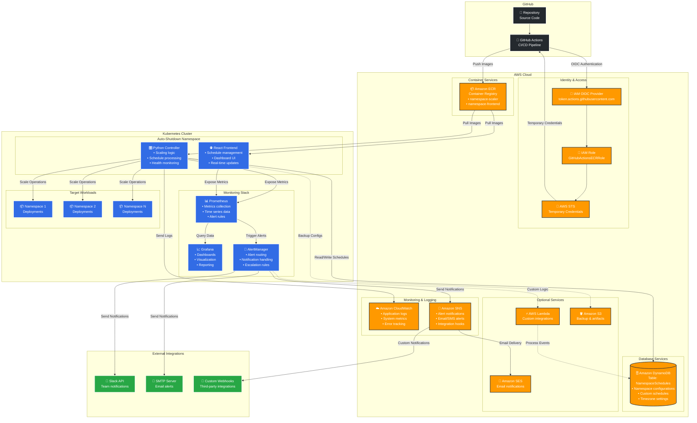

# Sistema de Apagado Automático de Namespaces

Sistema completo para optimización de costos en Karpenter mediante apagado automático de namespaces fuera de horarios laborales.

## 🎯 Características

- **Apagado automático**: Escala deployments a 0 replicas fuera de horarios laborales
- **Horarios personalizables**: Configuración por namespace vía DynamoDB
- **Monitoreo completo**: Métricas Prometheus, logs estructurados, alertas
- **Rollback automático**: Recuperación automática en caso de fallos
- **CI/CD seguro**: GitHub Actions con OIDC, sin access keys
- **Observabilidad**: Dashboards Grafana, health checks, trazabilidad completa

## 🏗️ Arquitectura

### Servicios AWS Utilizados



### Costos Estimados AWS (us-east-1)

| Servicio | Uso Estimado | Costo Mensual |
|----------|--------------|---------------|
| **ECR** | 2 repositorios, 1GB storage | $0.10 |
| **DynamoDB** | 1 tabla, 1GB, 100 RCU/WCU | $1.25 |
| **CloudWatch** | Logs (5GB), métricas básicas | $2.50 |
| **SNS** | 1,000 notificaciones/mes | $0.50 |
| **SES** | 1,000 emails/mes | $0.10 |
| **IAM/STS** | OIDC provider, roles | $0.00 |
| **Total Estimado** | | **~$4.45/mes** |

*Nota: Costos pueden variar según uso real y región AWS*

## 🚀 Quick Start

### 1. Configurar AWS OIDC

```bash
# Ejecutar script de configuración
chmod +x docs/setup-aws-oidc.sh
./docs/setup-aws-oidc.sh
```

### 2. Configurar GitHub Secrets

En tu repositorio GitHub → Settings → Secrets:
- `AWS_ROLE_ARN`: `arn:aws:iam::TU-ACCOUNT-ID:role/GitHubActionsECRRole`

### 3. Crear tabla DynamoDB

```bash
aws dynamodb create-table \
    --table-name NamespaceSchedules \
    --attribute-definitions \
        AttributeName=namespace,AttributeType=S \
    --key-schema \
        AttributeName=namespace,KeyType=HASH \
    --billing-mode PAY_PER_REQUEST
```

### 4. Desplegar con ArgoCD

```bash
kubectl apply -f argocd/bootstrap.yaml
```

## 📊 Monitoreo

### Métricas Disponibles

- `namespace_scaling_operations_total`: Operaciones de escalado por namespace
- `namespace_scaling_duration_seconds`: Duración de operaciones
- `namespace_active_count`: Número de namespaces activos
- `controller_errors_total`: Errores del controlador

### Health Checks

- **Liveness**: `http://controller:8081/health`
- **Readiness**: `http://controller:8081/health`
- **Metrics**: `http://controller:8080/metrics`

### Dashboards Grafana

1. **System Overview**: Estado general del sistema
2. **Operations**: Operaciones de escalado detalladas
3. **Cost Savings**: Ahorro de costos estimado
4. **Performance**: Métricas de rendimiento

## 🔧 Configuración

### Configuración de Servicios AWS

#### 1. Amazon ECR (Elastic Container Registry)
```bash
# Crear repositorios
aws ecr create-repository --repository-name namespace-scaler --region us-east-1
aws ecr create-repository --repository-name namespace-frontend --region us-east-1

# Configurar lifecycle policy para limitar imágenes
aws ecr put-lifecycle-policy \
    --repository-name namespace-scaler \
    --lifecycle-policy-text '{
        "rules": [{
            "rulePriority": 1,
            "selection": {
                "tagStatus": "untagged",
                "countType": "sinceImagePushed",
                "countUnit": "days",
                "countNumber": 7
            },
            "action": {"type": "expire"}
        }]
    }'
```

#### 2. Amazon DynamoDB
```bash
# Crear tabla principal
aws dynamodb create-table \
    --table-name NamespaceSchedules \
    --attribute-definitions \
        AttributeName=namespace,AttributeType=S \
        AttributeName=schedule_id,AttributeType=S \
    --key-schema \
        AttributeName=namespace,KeyType=HASH \
    --global-secondary-indexes \
        IndexName=schedule-index,KeySchema=[{AttributeName=schedule_id,KeyType=HASH}],Projection={ProjectionType=ALL},ProvisionedThroughput={ReadCapacityUnits=5,WriteCapacityUnits=5} \
    --billing-mode PAY_PER_REQUEST

# Habilitar Point-in-Time Recovery
aws dynamodb update-continuous-backups \
    --table-name NamespaceSchedules \
    --point-in-time-recovery-specification PointInTimeRecoveryEnabled=true
```

#### 3. Amazon CloudWatch
```bash
# Crear log group para el controller
aws logs create-log-group \
    --log-group-name /aws/kubernetes/namespace-controller \
    --retention-in-days 30

# Crear dashboard personalizado
aws cloudwatch put-dashboard \
    --dashboard-name "NamespaceController" \
    --dashboard-body file://cloudwatch-dashboard.json
```

#### 4. Amazon SNS (Simple Notification Service)
```bash
# Crear topic para alertas
aws sns create-topic --name namespace-controller-alerts

# Suscribir email para notificaciones
aws sns subscribe \
    --topic-arn arn:aws:sns:us-east-1:ACCOUNT-ID:namespace-controller-alerts \
    --protocol email \
    --notification-endpoint admin@company.com

# Configurar policy para AlertManager
aws sns set-topic-attributes \
    --topic-arn arn:aws:sns:us-east-1:ACCOUNT-ID:namespace-controller-alerts \
    --attribute-name Policy \
    --attribute-value file://sns-policy.json
```

#### 5. IAM Roles y Policies
```bash
# Policy para el controller en Kubernetes (acceso a DynamoDB)
cat > controller-policy.json << 'EOF'
{
    "Version": "2012-10-17",
    "Statement": [
        {
            "Effect": "Allow",
            "Action": [
                "dynamodb:GetItem",
                "dynamodb:PutItem",
                "dynamodb:UpdateItem",
                "dynamodb:DeleteItem",
                "dynamodb:Scan",
                "dynamodb:Query"
            ],
            "Resource": "arn:aws:dynamodb:us-east-1:*:table/NamespaceSchedules*"
        },
        {
            "Effect": "Allow",
            "Action": [
                "logs:CreateLogGroup",
                "logs:CreateLogStream",
                "logs:PutLogEvents"
            ],
            "Resource": "arn:aws:logs:us-east-1:*:log-group:/aws/kubernetes/namespace-controller*"
        }
    ]
}
EOF

# Crear role para el controller (si usas IRSA)
aws iam create-role \
    --role-name NamespaceControllerRole \
    --assume-role-policy-document file://irsa-trust-policy.json

aws iam create-policy \
    --policy-name NamespaceControllerPolicy \
    --policy-document file://controller-policy.json

aws iam attach-role-policy \
    --role-name NamespaceControllerRole \
    --policy-arn arn:aws:iam::ACCOUNT-ID:policy/NamespaceControllerPolicy
```

### Horarios por Defecto

- **Días laborales**: Lunes a Viernes
- **Horario activo**: 8:00 AM - 3:00 PM (Colombia)
- **Horario UTC**: 13:00 - 20:00

### Horarios Personalizados

Crear entrada en DynamoDB:

```json
{
  "namespace": "mi-aplicacion",
  "schedules": [
    {
      "date": "2024-01-15",
      "startup": "09:00",
      "shutdown": "17:00"
    }
  ]
}
```

### Variables de Entorno

| Variable | Descripción | Valor por Defecto |
|----------|-------------|-------------------|
| `DYNAMODB_TABLE` | Tabla de horarios | `NamespaceSchedules` |
| `TIMEZONE` | Zona horaria | `UTC` |
| `SYSTEM_NAMESPACES` | Namespaces excluidos | `kube-system,default,...` |
| `LOG_LEVEL` | Nivel de logging | `INFO` |

## 🔒 Seguridad

### Características de Seguridad

- **Contenedores no-root**: Todos los contenedores ejecutan como usuario no privilegiado
- **OIDC Authentication**: Sin access keys almacenadas
- **RBAC mínimo**: Permisos de menor privilegio
- **Vulnerability scanning**: Escaneo automático con Trivy
- **Security headers**: Headers de seguridad en frontend

### Escaneo de Seguridad

```bash
# Escanear imágenes localmente
trivy image namespace-scaler:latest
trivy image namespace-frontend:latest
```

## 🧪 Testing

### Ejecutar Tests

```bash
# Tests unitarios
pytest tests/unit/ --cov=src

# Tests de integración
pytest tests/integration/

# Tests de propiedades
pytest tests/properties/ --hypothesis-profile=ci
```

### Tests de Carga

```bash
# Instalar locust
pip install locust

# Ejecutar tests de carga
locust -f tests/performance/load_test.py --host=http://controller:8080
```

## 📚 Documentación

- [Diagramas de Arquitectura](docs/architecture-diagrams.md)
- [Configuración AWS OIDC](docs/aws-oidc-setup.md)
- [Spec Completo](.kiro/specs/namespace-auto-shutdown-system/)

## 🚨 Troubleshooting

### Problemas Comunes

**Controller no inicia:**
```bash
kubectl logs -n auto-shutdown deployment/namespace-scaler
kubectl describe pod -n auto-shutdown -l app=namespace-scaler
```

**GitHub Actions falla:**
- Verificar que AWS_ROLE_ARN esté configurado
- Confirmar que repositorios ECR existan
- Revisar permisos del IAM role

**Escalado no funciona:**
- Verificar conectividad a DynamoDB
- Confirmar permisos RBAC del ServiceAccount
- Revisar logs del controlador

### Logs Estructurados

```bash
# Ver logs en tiempo real
kubectl logs -f -n auto-shutdown deployment/namespace-scaler

# Filtrar por nivel de error
kubectl logs -n auto-shutdown deployment/namespace-scaler | jq 'select(.level=="error")'
```

## 🤝 Contribuir

1. Fork el repositorio
2. Crear feature branch: `git checkout -b feature/nueva-funcionalidad`
3. Commit cambios: `git commit -am 'Añadir nueva funcionalidad'`
4. Push branch: `git push origin feature/nueva-funcionalidad`
5. Crear Pull Request

## 📄 Licencia

MIT License - ver [LICENSE](LICENSE) para detalles.

## 🎉 Roadmap

- [ ] Soporte para StatefulSets y DaemonSets
- [ ] Integración con Slack para notificaciones
- [ ] Dashboard web para configuración
- [ ] Soporte multi-cluster
- [ ] Predicción de costos con ML
- [ ] Integración con AWS Cost Explorer
