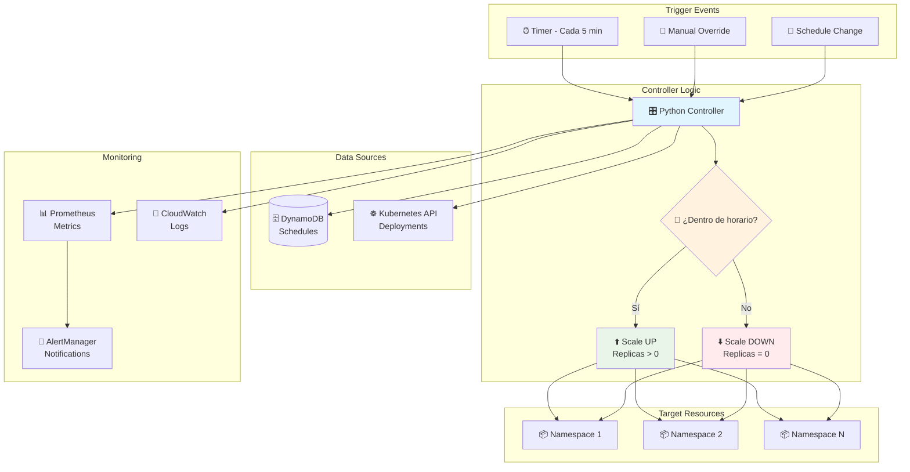
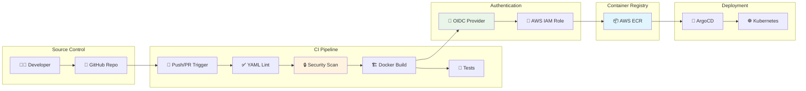
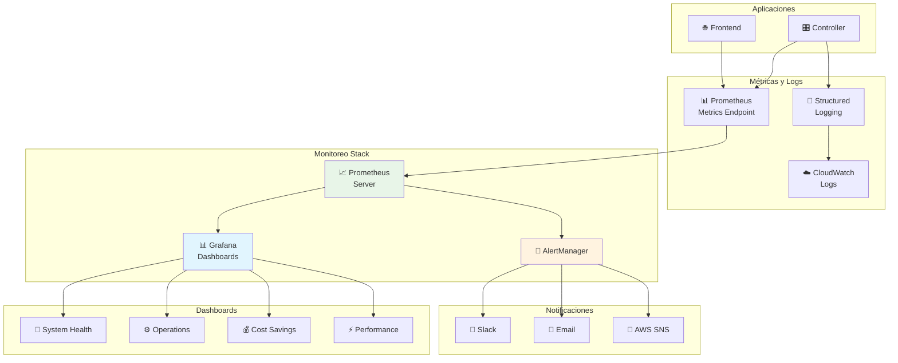
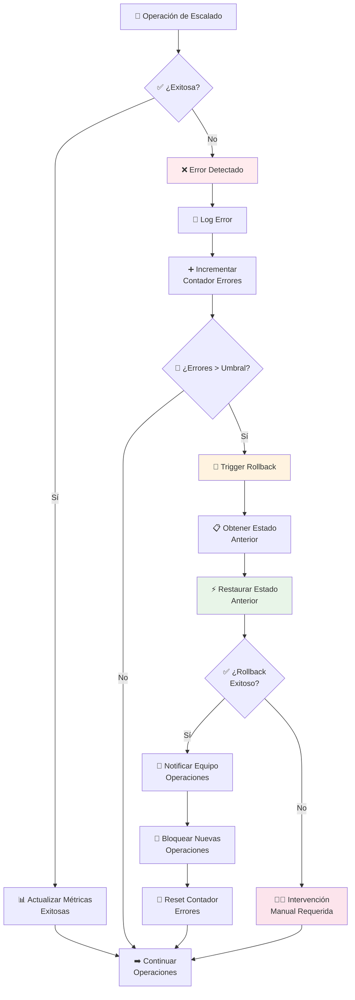
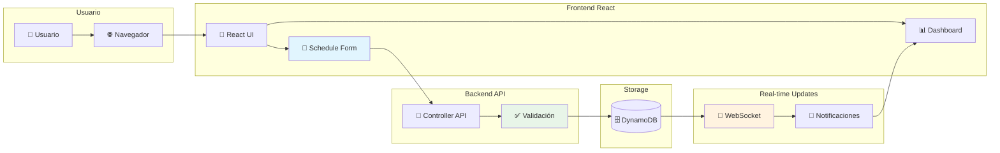

# Diagramas de Arquitectura - Sistema de Apagado Automático

## 1. Flujo General del Sistema



## 2. Flujo de CI/CD Pipeline



## 3. Flujo de Decisión de Escalado

```mermaid
graph TD
    Start([🚀 Inicio del Ciclo])
    GetNS[📋 Obtener Namespaces]
    LoopNS{🔄 Para cada Namespace}
    
    CheckSchedule[📅 Verificar Schedule<br/>en DynamoDB]
    HasCustom{❓ ¿Tiene horario<br/>personalizado?}
    
    CheckCustomTime[⏰ Verificar horario<br/>personalizado]
    CheckDefaultTime[⏰ Verificar horario<br/>por defecto<br/>(Lun-Vie 8AM-3PM)]
    
    InWorkHours{🕐 ¿Dentro del<br/>horario laboral?}
    
    GetCurrentState[📊 Obtener estado<br/>actual deployments]
    
    NeedScaleUp{⬆️ ¿Necesita<br/>escalar UP?}
    NeedScaleDown{⬇️ ¿Necesita<br/>escalar DOWN?}
    
    SaveOriginal[💾 Guardar replicas<br/>originales]
    ScaleToZero[⬇️ Escalar a 0<br/>replicas]
    RestoreOriginal[⬆️ Restaurar replicas<br/>originales]
    
    LogEvent[📝 Log evento]
    SendMetrics[📊 Enviar métricas]
    
    NextNS[➡️ Siguiente Namespace]
    Wait[⏳ Esperar 5 minutos]
    
    Start --> GetNS
    GetNS --> LoopNS
    LoopNS -->|Sí| CheckSchedule
    LoopNS -->|No| Wait
    
    CheckSchedule --> HasCustom
    HasCustom -->|Sí| CheckCustomTime
    HasCustom -->|No| CheckDefaultTime
    
    CheckCustomTime --> InWorkHours
    CheckDefaultTime --> InWorkHours
    
    InWorkHours --> GetCurrentState
    GetCurrentState --> NeedScaleUp
    GetCurrentState --> NeedScaleDown
    
    NeedScaleUp -->|Sí| RestoreOriginal
    NeedScaleDown -->|Sí| SaveOriginal
    SaveOriginal --> ScaleToZero
    
    RestoreOriginal --> LogEvent
    ScaleToZero --> LogEvent
    NeedScaleUp -->|No| NextNS
    NeedScaleDown -->|No| NextNS
    
    LogEvent --> SendMetrics
    SendMetrics --> NextNS
    NextNS --> LoopNS
    
    Wait --> Start
    
    style InWorkHours fill:#fff3e0
    style ScaleToZero fill:#ffebee
    style RestoreOriginal fill:#e8f5e8
    style SaveOriginal fill:#e1f5fe
```

## 4. Arquitectura de Monitoreo



## 5. Flujo de Manejo de Errores y Rollback



## 6. Flujo de Configuración de Horarios (Frontend)



## Métricas Clave del Sistema

### Métricas de Operación
- `namespace_scaling_operations_total{namespace, operation, status}`
- `namespace_scaling_duration_seconds{namespace, operation}`
- `namespace_active_count`
- `controller_errors_total{error_type}`

### Métricas de Infraestructura
- `dynamodb_operations_total{operation, status}`
- `kubernetes_api_calls_total{operation, status}`
- `frontend_requests_total{method, endpoint, status}`

### Métricas de Negocio
- `cost_savings_estimated_dollars`
- `namespaces_managed_total`
- `uptime_percentage`

## Alertas Configuradas

### Críticas
- Controller Down (5 min)
- High Error Rate (>10% por 2 min)
- DynamoDB Throttling
- Kubernetes API Unreachable

### Advertencias
- Scaling Operation Failures
- High Response Times
- Resource Utilization High

### Informativas
- Daily Cost Savings Report
- Weekly Operations Summary