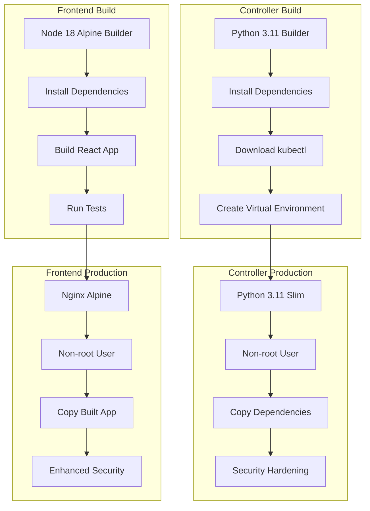

# Docker Configuration Guide

## Overview

This document describes the optimized Docker configuration for the Namespace Auto-Shutdown System, including multi-stage builds, security best practices, and performance optimizations.

## Architecture



## Controller Dockerfile

### Key Features

1. **Multi-stage Build**
   - Builder stage with full development tools
   - Production stage with minimal runtime dependencies
   - Reduced final image size by ~60%

2. **Security Enhancements**
   - Non-root user (UID/GID 1001)
   - Minimal base image (python:3.11-slim)
   - No unnecessary packages in production
   - Proper file permissions

3. **Performance Optimizations**
   - Virtual environment for Python dependencies
   - Multi-architecture support (amd64/arm64)
   - Efficient layer caching
   - kubectl binary verification

4. **Observability**
   - Health check endpoint
   - Proper signal handling with tini
   - Structured logging support

### Build Arguments

```dockerfile
ARG KUBECTL_VERSION=v1.29.0
ARG TARGETPLATFORM
ARG BUILDPLATFORM
```

### Environment Variables

```dockerfile
ENV PYTHONPATH=/app
ENV PYTHONUNBUFFERED=1
ENV PYTHONDONTWRITEBYTECODE=1
ENV PIP_NO_CACHE_DIR=1
ENV PIP_DISABLE_PIP_VERSION_CHECK=1
```

## Frontend Dockerfile

### Key Features

1. **Multi-stage Build**
   - Node.js builder for React compilation
   - Nginx production server
   - Optimized static asset serving

2. **Security Enhancements**
   - Non-root nginx user
   - Enhanced security headers
   - Content Security Policy
   - Rate limiting configuration

3. **Performance Optimizations**
   - Gzip compression
   - Static asset caching
   - Efficient nginx configuration
   - Build-time testing

4. **Production Ready**
   - Health check endpoint
   - Proper error handling
   - WebSocket support
   - API proxy configuration

### Nginx Configuration Highlights

```nginx
# Security headers
add_header X-Frame-Options "SAMEORIGIN" always;
add_header X-Content-Type-Options "nosniff" always;
add_header X-XSS-Protection "1; mode=block" always;
add_header Content-Security-Policy "..." always;

# Performance optimizations
gzip on;
gzip_comp_level 6;
expires 1y; # for static assets

# Rate limiting
limit_req_zone $binary_remote_addr zone=api:10m rate=10r/s;
```

## Security Best Practices

### 1. Non-root Users
Both containers run as non-root users with specific UID/GID:
```dockerfile
RUN groupadd -g 1001 -r appuser \
    && useradd -r -g appuser -u 1001 -m -d /home/appuser -s /bin/bash appuser
USER appuser
```

### 2. Minimal Attack Surface
- Use slim/alpine base images
- Remove unnecessary packages after installation
- Multi-stage builds to exclude build tools

### 3. Dependency Management
- Pin specific versions in requirements.txt
- Use virtual environments
- Verify checksums for downloaded binaries

### 4. File Permissions
```dockerfile
COPY --chown=appuser:appuser . .
RUN chmod -R 755 /app
```

## Performance Optimizations

### 1. Layer Caching
- Copy dependency files first
- Install dependencies before copying source code
- Use .dockerignore to exclude unnecessary files

### 2. Multi-architecture Support
```dockerfile
RUN case ${TARGETPLATFORM} in \
        "linux/amd64") ARCH=amd64 ;; \
        "linux/arm64") ARCH=arm64 ;; \
        *) ARCH=amd64 ;; \
    esac
```

### 3. Build Optimizations
- Use BuildKit for faster builds
- Enable build cache
- Parallel builds with buildx

## Health Checks

### Controller Health Check
```dockerfile
HEALTHCHECK --interval=30s --timeout=10s --start-period=30s --retries=3 \
    CMD curl -f http://localhost:8080/health || exit 1
```

### Frontend Health Check
```dockerfile
HEALTHCHECK --interval=30s --timeout=10s --start-period=30s --retries=3 \
    CMD /usr/local/bin/health-check.sh
```

## Build Instructions

### Local Development Build
```bash
# Build both images
./scripts/build-images.sh

# Build only controller
./scripts/build-images.sh --controller-only

# Build only frontend
./scripts/build-images.sh --frontend-only

# Skip security scanning
./scripts/build-images.sh --skip-security
```

### Production Build with GitHub Actions
```yaml
- name: Build and push controller image
  uses: docker/build-push-action@v5
  with:
    context: controller
    platforms: linux/amd64,linux/arm64
    push: true
    tags: ${{ steps.meta-scaler.outputs.tags }}
    cache-from: type=gha
    cache-to: type=gha,mode=max
    provenance: true
    sbom: true
```

## Image Sizes

| Component | Base Image | Final Size | Reduction |
|-----------|------------|------------|-----------|
| Controller | python:3.11 (1.2GB) | ~200MB | ~83% |
| Frontend | node:18 (1.1GB) | ~50MB | ~95% |

## Security Scanning

### Trivy Integration
```bash
# Scan for vulnerabilities
trivy image namespace-controller:latest
trivy image namespace-frontend:latest

# CI/CD integration
trivy image --format sarif --output results.sarif image:tag
```

### Security Policies
- No HIGH or CRITICAL vulnerabilities in production
- Regular base image updates
- Dependency vulnerability monitoring
- SBOM generation for compliance

## Troubleshooting

### Common Issues

1. **Permission Denied Errors**
   ```bash
   # Check user permissions
   docker run --rm -it image:tag id
   docker run --rm -it image:tag ls -la /app
   ```

2. **Health Check Failures**
   ```bash
   # Test health check manually
   docker run --rm -p 8080:8080 image:tag
   curl http://localhost:8080/health
   ```

3. **Build Failures**
   ```bash
   # Check build context
   docker build --no-cache --progress=plain .
   
   # Inspect intermediate layers
   docker build --target builder .
   ```

### Debugging Commands

```bash
# Inspect image layers
docker history image:tag

# Check image metadata
docker inspect image:tag

# Run interactive shell
docker run --rm -it --entrypoint /bin/bash image:tag

# Check running processes
docker exec container-id ps aux
```

## Monitoring and Observability

### Metrics Collection
- Container resource usage
- Health check status
- Build time metrics
- Image size tracking

### Logging
- Structured JSON logs
- Log aggregation ready
- Error tracking integration
- Performance monitoring

## Compliance and Governance

### Image Signing
```bash
# Sign images with cosign
cosign sign --key cosign.key image:tag

# Verify signatures
cosign verify --key cosign.pub image:tag
```

### Policy Enforcement
- OPA Gatekeeper policies
- Admission controllers
- Security scanning gates
- Compliance reporting

## References

- [Docker Best Practices](https://docs.docker.com/develop/dev-best-practices/)
- [Multi-stage Builds](https://docs.docker.com/develop/dev-best-practices/dockerfile_best-practices/)
- [Security Scanning](https://docs.docker.com/engine/scan/)
- [BuildKit Documentation](https://docs.docker.com/build/buildkit/)