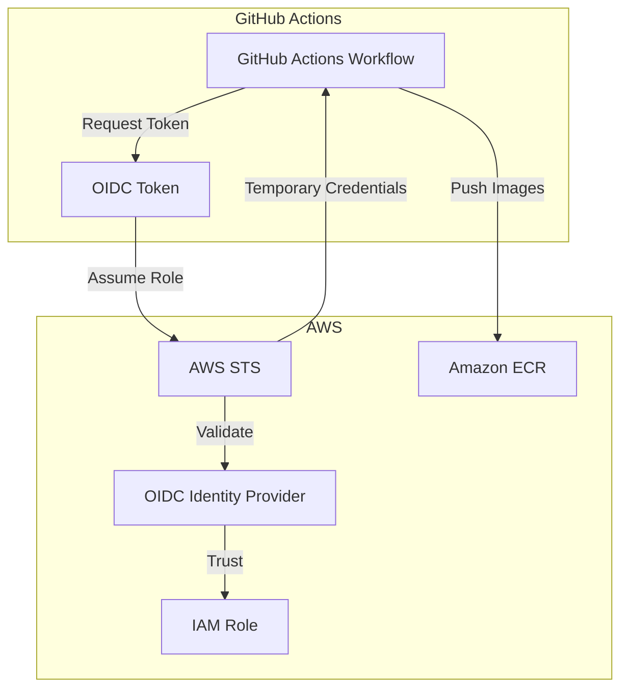

# OIDC Configuration for GitHub Actions

## Overview

This document describes the enhanced OIDC (OpenID Connect) configuration for the Namespace Auto-Shutdown System's CI/CD pipeline. The configuration follows security best practices and provides secure, keyless authentication to AWS services.

## Architecture



## Security Features

### 1. Enhanced Trust Policy
- **Repository-specific access**: Only specific branches and pull requests can assume the role
- **Audience validation**: Ensures tokens are intended for AWS STS
- **Subject validation**: Restricts access to specific repository patterns

### 2. Least Privilege IAM Policy
- **ECR-specific permissions**: Only necessary ECR operations are allowed
- **Resource-specific access**: Limited to specific ECR repositories
- **No wildcard permissions**: All permissions are explicitly scoped

### 3. Session Management
- **Short-lived tokens**: 1-hour maximum session duration
- **Session naming**: Unique session names for audit trails
- **Automatic rotation**: No long-term credentials stored

## Configuration Details

### OIDC Provider Configuration
```json
{
  "Url": "https://token.actions.githubusercontent.com",
  "ClientIdList": ["sts.amazonaws.com"],
  "ThumbprintList": ["6938fd4d98bab03faadb97b34396831e3780aea1"]
}
```

### Trust Policy
```json
{
  "Version": "2012-10-17",
  "Statement": [
    {
      "Effect": "Allow",
      "Principal": {
        "Federated": "arn:aws:iam::ACCOUNT_ID:oidc-provider/token.actions.githubusercontent.com"
      },
      "Action": "sts:AssumeRoleWithWebIdentity",
      "Condition": {
        "StringEquals": {
          "token.actions.githubusercontent.com:aud": "sts.amazonaws.com"
        },
        "StringLike": {
          "token.actions.githubusercontent.com:sub": [
            "repo:USERNAME/REPOSITORY:ref:refs/heads/main",
            "repo:USERNAME/REPOSITORY:ref:refs/heads/develop",
            "repo:USERNAME/REPOSITORY:pull_request"
          ]
        }
      }
    }
  ]
}
```

### ECR Policy
```json
{
  "Version": "2012-10-17",
  "Statement": [
    {
      "Sid": "ECRAuthToken",
      "Effect": "Allow",
      "Action": ["ecr:GetAuthorizationToken"],
      "Resource": "*"
    },
    {
      "Sid": "ECRRepositoryAccess",
      "Effect": "Allow",
      "Action": [
        "ecr:BatchCheckLayerAvailability",
        "ecr:GetDownloadUrlForLayer",
        "ecr:BatchGetImage",
        "ecr:BatchImportLayerPart",
        "ecr:CompleteLayerUpload",
        "ecr:DescribeRepositories",
        "ecr:DescribeImages",
        "ecr:InitiateLayerUpload",
        "ecr:PutImage",
        "ecr:UploadLayerPart",
        "ecr:ListImages"
      ],
      "Resource": [
        "arn:aws:ecr:REGION:ACCOUNT_ID:repository/namespace-scaler",
        "arn:aws:ecr:REGION:ACCOUNT_ID:repository/namespace-frontend"
      ]
    }
  ]
}
```

## GitHub Actions Configuration

### Required Permissions
```yaml
permissions:
  contents: write
  id-token: write
  packages: write
  security-events: write
  actions: read
```

### OIDC Authentication Step
```yaml
- name: Configure AWS credentials with OIDC
  uses: aws-actions/configure-aws-credentials@v4
  with:
    role-to-assume: ${{ secrets.AWS_ROLE_ARN }}
    role-session-name: GitHubActions-${{ github.run_id }}-${{ github.run_attempt }}
    aws-region: ${{ env.AWS_REGION }}
    role-duration-seconds: 3600
    mask-aws-account-id: false
```

## Setup Instructions

### 1. Run the Setup Script
```bash
./setup-aws-oidc.sh
```

### 2. Configure GitHub Secrets
Add the following secret to your GitHub repository:
- **Name**: `AWS_ROLE_ARN`
- **Value**: `arn:aws:iam::ACCOUNT_ID:role/GitHubActionsNamespaceControllerRole`

### 3. Verify Configuration
The workflow will automatically verify the OIDC configuration by:
- Checking AWS identity after authentication
- Validating ECR access
- Testing image push capabilities

## Troubleshooting

### Common Issues

#### 1. "No OpenIDConnect provider found"
**Cause**: OIDC provider not created or incorrect ARN
**Solution**: Run the setup script or verify the provider exists

#### 2. "Not authorized to perform sts:AssumeRoleWithWebIdentity"
**Cause**: Trust policy doesn't match the repository or branch
**Solution**: Verify the trust policy conditions match your repository

#### 3. "Access denied" during ECR operations
**Cause**: IAM policy doesn't include necessary ECR permissions
**Solution**: Verify the ECR policy is attached to the role

### Debugging Steps

1. **Check OIDC Token Claims**:
   ```yaml
   - name: Debug OIDC Token
     run: |
       curl -H "Authorization: bearer $ACTIONS_ID_TOKEN_REQUEST_TOKEN" \
            "$ACTIONS_ID_TOKEN_REQUEST_URL&audience=sts.amazonaws.com" | \
            jq -r '.value' | jq -R 'split(".") | .[1] | @base64d | fromjson'
   ```

2. **Verify AWS Identity**:
   ```yaml
   - name: Verify AWS Identity
     run: |
       aws sts get-caller-identity
       aws sts get-session-token --duration-seconds 900
   ```

3. **Test ECR Access**:
   ```yaml
   - name: Test ECR Access
     run: |
       aws ecr describe-repositories --region ${{ env.AWS_REGION }}
       aws ecr get-login-password --region ${{ env.AWS_REGION }}
   ```

## Security Considerations

### Best Practices
1. **Principle of Least Privilege**: Only grant necessary permissions
2. **Repository Restrictions**: Limit access to specific repositories and branches
3. **Session Duration**: Use shortest possible session duration
4. **Audit Logging**: Enable CloudTrail for all API calls
5. **Regular Review**: Periodically review and update policies

### Monitoring
- Monitor CloudTrail logs for unusual activity
- Set up alerts for failed authentication attempts
- Review ECR access patterns regularly

### Compliance
- All actions are logged in CloudTrail
- No long-term credentials are stored
- Access is automatically revoked when sessions expire
- Supports compliance with security frameworks (SOC2, ISO27001)

## References
- [GitHub OIDC Documentation](https://docs.github.com/en/actions/deployment/security-hardening-your-deployments/about-security-hardening-with-openid-connect)
- [AWS IAM OIDC Documentation](https://docs.aws.amazon.com/IAM/latest/UserGuide/id_roles_providers_create_oidc.html)
- [ECR Authentication](https://docs.aws.amazon.com/AmazonECR/latest/userguide/registry_auth.html)