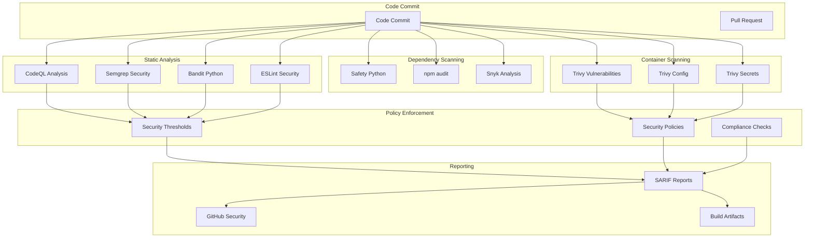

# Security Scanning Guide

## Overview

This document describes the comprehensive security scanning implementation for the Namespace Auto-Shutdown System. The security scanning pipeline includes multiple layers of analysis to ensure code quality, vulnerability detection, and compliance with security best practices.

## Security Scanning Architecture



## Security Scanning Components

### 1. Static Code Analysis

#### CodeQL Analysis
- **Purpose**: Advanced semantic code analysis for security vulnerabilities
- **Languages**: Python, JavaScript, TypeScript
- **Configuration**: `.github/codeql/codeql-config.yml`
- **Query Suites**: 
  - `security-extended`: Extended security queries
  - `security-and-quality`: Combined security and quality analysis

**Key Features**:
- CWE (Common Weakness Enumeration) detection
- OWASP Top 10 vulnerability patterns
- Custom security queries
- Integration with GitHub Security tab

#### Semgrep Security Analysis
- **Purpose**: Fast, customizable static analysis
- **Rule Sets**:
  - `p/security-audit`: General security audit rules
  - `p/secrets`: Secret detection rules
  - `p/owasp-top-ten`: OWASP Top 10 patterns
  - `p/kubernetes`: Kubernetes security rules

#### Bandit (Python)
- **Purpose**: Python-specific security linter
- **Configuration**: `pyproject.toml`
- **Focus Areas**:
  - Hardcoded passwords and secrets
  - SQL injection vulnerabilities
  - Shell injection risks
  - Cryptographic weaknesses

#### ESLint Security (JavaScript/TypeScript)
- **Purpose**: JavaScript/TypeScript security linting
- **Configuration**: `frontend/.eslintrc.security.js`
- **Security Rules**:
  - XSS prevention
  - Unsafe regex detection
  - Dangerous React patterns
  - Input validation issues

### 2. Dependency Scanning

#### Python Dependencies (Safety)
- **Purpose**: Scan Python packages for known vulnerabilities
- **Database**: PyUp.io vulnerability database
- **Output**: JSON report with vulnerability details

#### Node.js Dependencies (npm audit)
- **Purpose**: Scan npm packages for security vulnerabilities
- **Database**: npm security advisory database
- **Severity Levels**: Critical, High, Moderate, Low

### 3. Container Image Scanning

#### Trivy Vulnerability Scanner
- **Purpose**: Comprehensive container security scanning
- **Configuration**: `trivy.yaml`
- **Scan Types**:
  - **Vulnerability Scanning**: OS and library vulnerabilities
  - **Configuration Scanning**: Dockerfile and Kubernetes misconfigurations
  - **Secret Scanning**: Hardcoded secrets and credentials

**Trivy Features**:
- Multi-format output (SARIF, JSON, HTML)
- Custom ignore policies (`.trivyignore`)
- License compliance checking
- SBOM (Software Bill of Materials) generation

### 4. Security Thresholds and Policies

#### Vulnerability Thresholds
```yaml
Critical: 0      # No critical vulnerabilities allowed
High: 5          # Maximum 5 high severity vulnerabilities
Medium: 20       # Maximum 20 medium severity vulnerabilities
Low: 50          # Maximum 50 low severity vulnerabilities
```

#### Container Security Policies
- **Non-root containers**: All containers must run as non-root users
- **Resource limits**: Required CPU and memory limits
- **Security contexts**: Mandatory security context configuration
- **Base image restrictions**: Only approved base images allowed

#### Secret Detection Policies
- **Zero tolerance**: Any detected secrets fail the build
- **Pattern matching**: Custom regex patterns for various secret types
- **Entropy analysis**: High-entropy string detection
- **Context awareness**: File type and location-based rules

## Security Scanning Workflow

### 1. Pre-commit Hooks
```bash
# Install pre-commit hooks
pre-commit install

# Run security checks locally
pre-commit run --all-files
```

### 2. Pull Request Scanning
- All security scans run on every pull request
- Results posted as PR comments and checks
- Blocking checks prevent merge if security issues found

### 3. Main Branch Scanning
- Full security scan suite on main branch commits
- Container images scanned after successful build
- Security reports uploaded to GitHub Security tab

### 4. Scheduled Scanning
- Weekly dependency vulnerability scans
- Monthly comprehensive security audits
- Quarterly compliance assessments

## Security Thresholds Configuration

### Vulnerability Severity Mapping
| Scanner | Critical | High | Medium | Low |
|---------|----------|------|--------|-----|
| CodeQL | Error | Warning | Note | Info |
| Trivy | CRITICAL | HIGH | MEDIUM | LOW |
| Bandit | HIGH | MEDIUM | LOW | INFO |
| Semgrep | ERROR | WARNING | INFO | INFO |

### Failure Conditions
The pipeline fails if any of the following conditions are met:

1. **Critical vulnerabilities**: Any critical vulnerability detected
2. **High vulnerability threshold**: More than 5 high-severity vulnerabilities
3. **Secret detection**: Any hardcoded secrets or credentials found
4. **Policy violations**: Container security policy violations
5. **License compliance**: Use of forbidden licenses

### Warning Conditions
The pipeline shows warnings (but doesn't fail) for:

1. **Medium vulnerabilities**: More than 20 medium-severity vulnerabilities
2. **Code quality issues**: Non-security code quality problems
3. **Best practice violations**: Recommended but not required practices

## Security Reports and Artifacts

### SARIF Reports
- **Format**: Security Analysis Results Interchange Format
- **Integration**: GitHub Security tab, VS Code, other SARIF-compatible tools
- **Content**: Vulnerabilities, locations, remediation guidance

### JSON Reports
- **Purpose**: Machine-readable security scan results
- **Usage**: CI/CD integration, custom tooling, metrics collection
- **Retention**: 30 days in GitHub Actions artifacts

### HTML Reports
- **Purpose**: Human-readable security dashboards
- **Content**: Executive summaries, detailed findings, trend analysis
- **Distribution**: Stakeholder reports, security reviews

## Remediation Guidelines

### Critical Vulnerabilities
- **SLA**: 24 hours
- **Process**: Immediate hotfix, emergency deployment
- **Notification**: Slack, email, PagerDuty

### High Vulnerabilities
- **SLA**: 7 days
- **Process**: Priority fix in next sprint
- **Notification**: Slack, email

### Medium Vulnerabilities
- **SLA**: 30 days
- **Process**: Include in regular development cycle
- **Notification**: GitHub issue, weekly report

### Low Vulnerabilities
- **SLA**: 90 days
- **Process**: Address during maintenance windows
- **Notification**: Monthly security report

## Security Scanning Commands

### Local Development
```bash
# Run all security scans locally
make security-scan

# Run specific scanners
make bandit-scan      # Python security scan
make eslint-security  # JavaScript security scan
make trivy-scan       # Container security scan
make safety-check     # Dependency vulnerability scan
```

### CI/CD Pipeline
```bash
# Trigger security scan job
gh workflow run security-scan

# View security scan results
gh run list --workflow=security-scan
gh run view <run-id>
```

### Container Scanning
```bash
# Scan local container image
trivy image <image-name>

# Scan with custom config
trivy --config trivy.yaml image <image-name>

# Generate SARIF report
trivy image --format sarif --output report.sarif <image-name>
```

## Security Metrics and KPIs

### Vulnerability Metrics
- **Mean Time to Detection (MTTD)**: Average time to detect vulnerabilities
- **Mean Time to Resolution (MTTR)**: Average time to fix vulnerabilities
- **Vulnerability Density**: Vulnerabilities per 1000 lines of code
- **Security Debt**: Total outstanding security issues by severity

### Compliance Metrics
- **Policy Compliance Rate**: Percentage of scans passing all policies
- **Secret Detection Rate**: Percentage of commits with detected secrets
- **Container Security Score**: Aggregate security score for container images
- **Dependency Health Score**: Percentage of dependencies without known vulnerabilities

### Trend Analysis
- **Weekly vulnerability trends**: Track vulnerability introduction and resolution
- **Security posture improvement**: Month-over-month security improvements
- **Tool effectiveness**: Comparison of different security scanning tools

## Troubleshooting

### Common Issues

#### False Positives
- **Solution**: Add to appropriate ignore file (`.trivyignore`, `.bandit`, etc.)
- **Process**: Document reason and review regularly

#### Performance Issues
- **Symptoms**: Long scan times, timeouts
- **Solutions**: 
  - Optimize scan scope with exclude patterns
  - Use incremental scanning where possible
  - Parallelize scans across multiple runners

#### Integration Issues
- **Symptoms**: SARIF upload failures, missing reports
- **Solutions**:
  - Verify GitHub token permissions
  - Check SARIF file format validity
  - Review workflow job dependencies

### Support and Escalation
- **Level 1**: Development team (code fixes, false positive handling)
- **Level 2**: DevOps team (pipeline issues, tool configuration)
- **Level 3**: Security team (policy decisions, compliance requirements)

## Continuous Improvement

### Regular Reviews
- **Monthly**: Security scan effectiveness review
- **Quarterly**: Security policy and threshold review
- **Annually**: Complete security scanning strategy review

### Tool Updates
- **Security databases**: Automatic daily updates
- **Scanning tools**: Monthly version updates
- **Rule sets**: Quarterly rule set reviews and updates

### Training and Awareness
- **Developer training**: Secure coding practices, security tool usage
- **Security champions**: Advanced security scanning and analysis
- **Incident response**: Security vulnerability response procedures