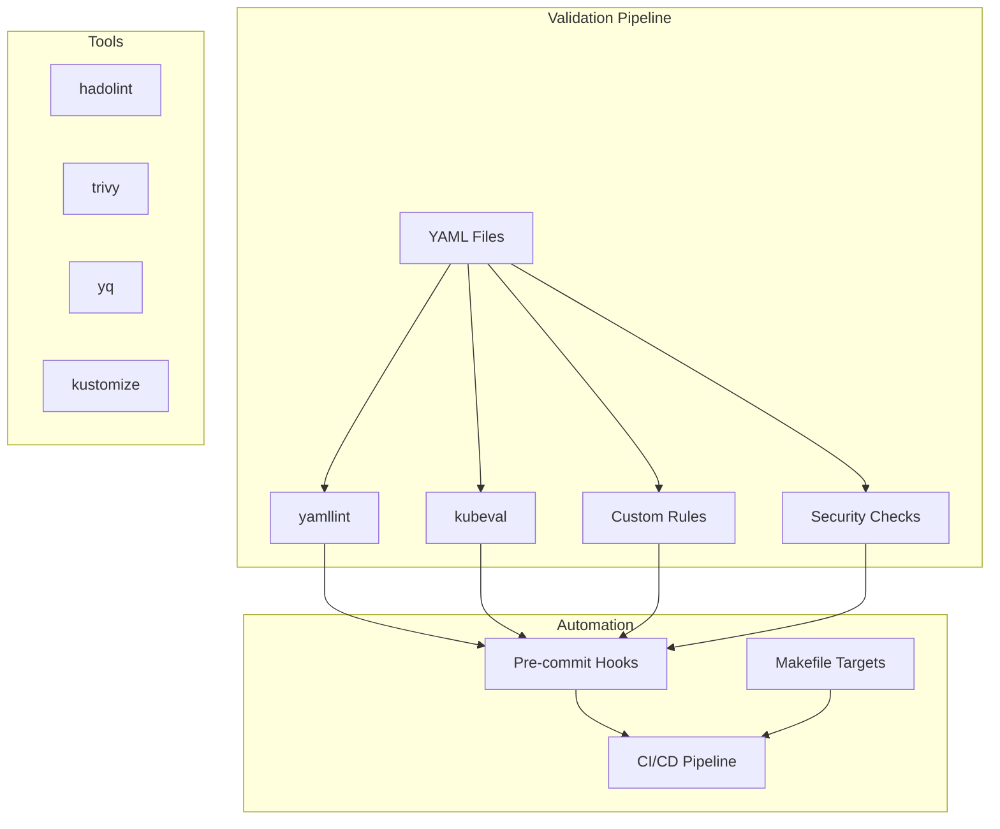

# YAML Validation Guide

## Overview

This document describes the comprehensive YAML validation system implemented for the Namespace Auto-Shutdown System. The validation system ensures code quality, security, and compliance with Kubernetes best practices.

## Architecture



## Validation Layers

### 1. YAML Syntax Validation (yamllint)

**Purpose**: Ensures YAML files have correct syntax and follow formatting standards.

**Configuration**: `.yamllint.yml`
```yaml
extends: relaxed
rules:
  line-length:
    max: 120
    level: warning
  indentation:
    spaces: 2
    indent-sequences: true
  truthy:
    allowed-values: ['true', 'false', 'yes', 'no', 'on', 'off']
```

**What it checks**:
- YAML syntax correctness
- Consistent indentation (2 spaces)
- Line length limits (120 characters)
- Proper boolean values
- Trailing spaces and empty lines

### 2. Kubernetes Manifest Validation (kubeval)

**Purpose**: Validates Kubernetes manifests against official schemas.

**Configuration**: `.kubeval.yaml`
```yaml
kubernetes-version: "1.29.0"
schema-location: "https://raw.githubusercontent.com/instrumenta/kubernetes-json-schema/master"
ignore-missing-schemas: true
strict: false
```

**What it checks**:
- Kubernetes API version compatibility
- Resource schema compliance
- Required fields presence
- Field type validation
- CRD schema validation (when available)

### 3. Security Validation

**Purpose**: Identifies security issues and compliance violations.

**Security Checks**:
- **Hardcoded Secrets**: Detects potential secrets in plain text
- **Security Context**: Ensures non-root users and security policies
- **RBAC Permissions**: Identifies overly permissive roles
- **Pod Security Standards**: Validates against Pod Security Standards
- **Network Policies**: Checks for network isolation
- **Resource Limits**: Ensures resource constraints

**Example Security Rules**:
```bash
# Check for hardcoded secrets
grep -qE "(password|secret|token|key):\s*['\"]?[a-zA-Z0-9]" file.yaml

# Check for missing security context
grep -q "securityContext:" file.yaml

# Check for privileged containers
grep -q "privileged: true" file.yaml
```

### 4. Best Practices Validation

**Purpose**: Enforces Kubernetes best practices and operational excellence.

**Best Practice Checks**:
- **Resource Limits**: CPU and memory limits/requests
- **Health Checks**: Liveness and readiness probes
- **Labels**: Required labels for resource management
- **Image Policies**: Avoid latest tags, specify pull policies
- **Service Accounts**: Proper service account configuration

### 5. Custom Rules Validation

**Purpose**: Enforces organization-specific policies and standards.

**Custom Rules**:
- **Naming Conventions**: Resource naming standards
- **Annotations**: Required annotations for monitoring/routing
- **Environment-specific**: Different rules for dev/staging/prod
- **Compliance**: Industry-specific compliance requirements

## Validation Tools

### Core Tools

| Tool | Purpose | Configuration |
|------|---------|---------------|
| yamllint | YAML syntax and style | `.yamllint.yml` |
| kubeval | Kubernetes schema validation | `.kubeval.yaml` |
| hadolint | Dockerfile linting | `.hadolint.yaml` |
| trivy | Security vulnerability scanning | Built-in |
| yq | YAML processing and queries | Command-line |
| kustomize | Kustomization validation | Built-in |

### Installation

#### Automatic Installation
```bash
# Install all tools automatically
./scripts/setup-validation-tools.sh

# Install specific tool categories
./scripts/setup-validation-tools.sh --skip-node
./scripts/setup-validation-tools.sh --skip-binary
```

#### Manual Installation
```bash
# Python tools
pip install yamllint pytest black flake8 isort

# Binary tools (Linux)
curl -L https://github.com/instrumenta/kubeval/releases/download/v0.16.1/kubeval-linux-amd64.tar.gz | tar xz
sudo mv kubeval /usr/local/bin/

# Using package managers
brew install yamllint kubeval hadolint trivy yq  # macOS
apt install yamllint  # Ubuntu
```

## Usage

### Command Line Interface

#### Basic Validation
```bash
# Validate all YAML files
make lint-yaml

# Comprehensive YAML validation
make validate-yaml

# Kubernetes security validation
make validate-security

# All validations
make validate
```

#### Advanced Usage
```bash
# Validate specific directory
./scripts/validate-yaml.sh controller/

# Only syntax validation
./scripts/validate-yaml.sh --only-syntax

# Skip Kubernetes validation
./scripts/validate-yaml.sh --skip-kubernetes

# Security-only validation
./scripts/validate-k8s-manifests.sh --security-only
```

### Makefile Targets

```bash
# Linting
make lint              # All linting
make lint-yaml         # YAML linting only
make lint-k8s          # Kubernetes validation

# Validation
make validate          # All validations
make validate-yaml     # YAML validation
make validate-security # Security validation
make validate-docker   # Dockerfile validation

# Development
make dev-setup         # Setup development environment
make install-tools     # Install validation tools
make format           # Format code
make check            # Run all checks
```

### Pre-commit Integration

The validation system integrates with pre-commit hooks for automatic validation:

```bash
# Install pre-commit hooks
pre-commit install

# Run on all files
pre-commit run --all-files

# Run specific hook
pre-commit run yamllint
pre-commit run kubeval
```

**Pre-commit Configuration** (`.pre-commit-config.yaml`):
```yaml
repos:
  - repo: https://github.com/adrienverge/yamllint
    rev: v1.35.1
    hooks:
      - id: yamllint
        args: [-c=.yamllint.yml]

  - repo: local
    hooks:
      - id: kubeval
        name: Validate Kubernetes manifests
        entry: scripts/validate-k8s-manifests.sh
        language: script
```

## CI/CD Integration

### GitHub Actions Integration

The validation system is integrated into the GitHub Actions workflow:

```yaml
jobs:
  lint-and-test:
    runs-on: ubuntu-latest
    steps:
      - name: Checkout code
        uses: actions/checkout@v4

      - name: Install validation tools
        run: ./scripts/setup-validation-tools.sh

      - name: Lint YAML files
        run: yamllint .

      - name: Validate Kubernetes manifests
        run: ./scripts/validate-k8s-manifests.sh

      - name: Comprehensive YAML validation
        run: ./scripts/validate-yaml.sh
```

### Validation Reports

The validation system generates comprehensive reports:

```
========================================
Kubernetes Security Validation Report
========================================
Total manifests processed: 15
Manifests passed: 12
Manifests failed: 3
Security issues: 5
Warnings: 8

🚨 5 security issues found that need attention
```

## Configuration Files

### .yamllint.yml
```yaml
extends: relaxed
rules:
  line-length:
    max: 120
    level: warning
    allow-non-breakable-words: true
  indentation:
    spaces: 2
    indent-sequences: true
  truthy:
    allowed-values: ['true', 'false', 'yes', 'no', 'on', 'off']
    check-keys: false
  # ... additional rules
```

### .kubeval.yaml
```yaml
kubernetes-version: "1.29.0"
schema-location: "https://raw.githubusercontent.com/instrumenta/kubernetes-json-schema/master"
ignore-missing-schemas: true
skip-kinds:
  - "Kustomization"
  - "Application"
```

### .hadolint.yaml
```yaml
ignored:
  - DL3008  # Pin versions in apt get install
  - DL3009  # Delete the apt-get lists after installing something
trustedRegistries:
  - docker.io
  - gcr.io
  - quay.io
```

## Validation Rules

### Security Rules

#### 1. Security Context Validation
```yaml
# ✅ Good - Non-root user with security context
securityContext:
  runAsNonRoot: true
  runAsUser: 1001
  readOnlyRootFilesystem: true
  allowPrivilegeEscalation: false

# ❌ Bad - Missing security context
containers:
  - name: app
    image: myapp:latest
```

#### 2. RBAC Validation
```yaml
# ✅ Good - Specific permissions
rules:
- apiGroups: [""]
  resources: ["pods"]
  verbs: ["get", "list"]

# ❌ Bad - Overly permissive
rules:
- apiGroups: ["*"]
  resources: ["*"]
  verbs: ["*"]
```

#### 3. Secret Management
```yaml
# ✅ Good - Reference to secret
env:
- name: DB_PASSWORD
  valueFrom:
    secretKeyRef:
      name: db-secret
      key: password

# ❌ Bad - Hardcoded secret
env:
- name: DB_PASSWORD
  value: "hardcoded-password"
```

### Best Practice Rules

#### 1. Resource Limits
```yaml
# ✅ Good - Resource limits specified
resources:
  requests:
    memory: "128Mi"
    cpu: "100m"
  limits:
    memory: "512Mi"
    cpu: "500m"

# ❌ Bad - No resource limits
containers:
- name: app
  image: myapp:latest
```

#### 2. Health Checks
```yaml
# ✅ Good - Health checks configured
livenessProbe:
  httpGet:
    path: /health
    port: 8080
  initialDelaySeconds: 30
readinessProbe:
  httpGet:
    path: /ready
    port: 8080
  initialDelaySeconds: 5

# ❌ Bad - No health checks
containers:
- name: app
  image: myapp:latest
```

#### 3. Image Policies
```yaml
# ✅ Good - Specific tag and pull policy
image: myapp:v1.2.3
imagePullPolicy: IfNotPresent

# ❌ Bad - Latest tag
image: myapp:latest
```

## Troubleshooting

### Common Issues

#### 1. yamllint Errors
```bash
# Error: line too long
./file.yaml:10:121: [error] line too long (125 > 120 characters)

# Solution: Break long lines or adjust config
line-length:
  max: 150  # Increase limit
```

#### 2. kubeval Errors
```bash
# Error: missing schema
WARN - Set to ignore missing schemas

# Solution: Update kubeval config
ignore-missing-schemas: true
```

#### 3. Security Validation Failures
```bash
# Error: missing security context
🔒 SECURITY: Missing security context in: deployment.yaml

# Solution: Add security context
securityContext:
  runAsNonRoot: true
  runAsUser: 1001
```

### Debugging Commands

```bash
# Verbose validation
./scripts/validate-yaml.sh --verbose

# Test specific file
yamllint specific-file.yaml
kubeval specific-file.yaml

# Check tool versions
yamllint --version
kubeval --version

# Validate installation
./scripts/setup-validation-tools.sh --verify-only
```

## Best Practices

### 1. Development Workflow
1. **Write YAML**: Create or modify YAML files
2. **Local Validation**: Run `make lint` before committing
3. **Pre-commit Hooks**: Automatic validation on commit
4. **CI/CD Pipeline**: Comprehensive validation in pipeline
5. **Review Process**: Manual review for security and best practices

### 2. Configuration Management
- Keep validation configs in version control
- Use consistent rules across projects
- Document custom rules and exceptions
- Regular updates of validation tools

### 3. Security Focus
- Treat security violations as blocking issues
- Regular security rule updates
- Security training for development team
- Automated security scanning in CI/CD

### 4. Performance Optimization
- Use parallel validation where possible
- Cache validation results
- Skip validation for generated files
- Optimize validation rules for speed

## Integration Examples

### Docker Compose Integration
```yaml
# docker-compose.yml
version: '3.8'
services:
  validator:
    image: alpine:latest
    volumes:
      - .:/workspace
    working_dir: /workspace
    command: ./scripts/validate-yaml.sh
```

### IDE Integration

#### VS Code
```json
// .vscode/settings.json
{
  "yaml.validate": true,
  "yaml.schemas": {
    "kubernetes": "*.yaml"
  },
  "yaml.customTags": [
    "!reference sequence"
  ]
}
```

#### Vim/Neovim
```vim
" .vimrc
autocmd BufWritePost *.yaml,*.yml !yamllint %
```

## Metrics and Monitoring

### Validation Metrics
- **Files Processed**: Total YAML files validated
- **Pass Rate**: Percentage of files passing validation
- **Security Issues**: Number of security violations found
- **Performance**: Validation execution time
- **Tool Coverage**: Which tools are being used

### Reporting
```bash
# Generate validation report
./scripts/validate-yaml.sh > validation-report.txt

# Security report
./scripts/validate-k8s-manifests.sh --security-only > security-report.txt
```

## References

- [yamllint Documentation](https://yamllint.readthedocs.io/)
- [kubeval Documentation](https://kubeval.instrumenta.dev/)
- [Kubernetes Best Practices](https://kubernetes.io/docs/concepts/configuration/overview/)
- [Pod Security Standards](https://kubernetes.io/docs/concepts/security/pod-security-standards/)
- [YAML Specification](https://yaml.org/spec/1.2/spec.html)